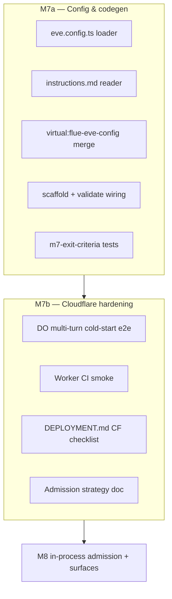
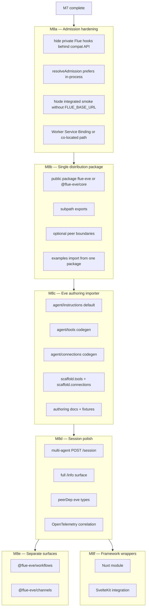

# flue-eve-vite — Implementation Plan

> **Goal:** Build a full Eve-compatible implementation on top of Flue: Eve authoring model, HTTP routes, client SDK, React hooks, connections, workflows/channels where applicable, and migration tooling, while **Flue** (`@flue/runtime`) powers the open runtime underneath.

This document is the authoritative planning artifact for the project. Agent onboarding lives in **`AGENTS.md`**. When this plan and `AGENTS.md` disagree on design, **this file wins**.

**Compat target:** Eve docs snapshot as of **2026-06-17** (beta). Track drift via `COMPAT_API_VERSION` (see §9.5).

---

## Table of Contents

1. [Executive Summary](#1-executive-summary)
2. [Problem Statement](#2-problem-statement)
3. [Compatibility Contract](#3-compatibility-contract)
4. [Design Principles](#4-design-principles)
5. [Architecture Overview](#5-architecture-overview) — incl. [§5.1 Flue surfaces vs Eve scope](#51-flue-runtime-surfaces-vs-eve-compat-scope)
6. [Package Structure](#6-package-structure)
7. [Vite Plugin Responsibilities](#7-vite-plugin-responsibilities)
8. [Runtime Shim (`compat-server`)](#8-runtime-shim-compat-server)
9. [Client Packages](#9-client-packages)
10. [API Mapping Reference](#10-api-mapping-reference)
11. [Event Translation Specification](#11-event-translation-specification)
12. [Session & Token State Machine](#12-session--token-state-machine)
13. [Dev vs Production Topology](#13-dev-vs-production-topology)
14. [Authoring Model & Codegen](#14-authoring-model--codegen)
15. [Configuration Surface](#15-configuration-surface)
16. [Invariants](#16-invariants)
17. [Assumptions](#17-assumptions)
18. [Edge Cases & Failure Modes](#18-edge-cases--failure-modes)
19. [Risk Register](#19-risk-register)
20. [Deferred Surfaces (not v1, still compatibility targets)](#20-deferred-surfaces-not-v1-still-compatibility-targets)
21. [Milestones](#21-milestones)
22. [Success Criteria](#22-success-criteria)
23. [Testing Strategy](#23-testing-strategy)
24. [Open Questions](#24-open-questions)
25. [Decision Log](#25-decision-log)
26. [Future Ideas (superseded by M8)](#26-future-ideas--superseded-by-m8)
27. [Connections Shim (Vercel Connect)](#27-connections-shim-vercel-connect)
28. [Reference Links](#28-reference-links)

---

## 1. Executive Summary

**flue-eve-vite** is a full Eve-compatibility implementation powered by Flue, not a fork of Eve or Flue. It is **not** an official Vercel or Astro product.

| Layer | Technology | Role |
|-------|------------|------|
| Frontend contract | Eve API shape | Stable routes, client types, hook ergonomics |
| Integration | Vite plugin | Dev orchestration, optional scaffold, proxy |
| Translation | compat-server | HTTP adapter + **event journal** + NDJSON mapper |
| Runtime | Flue | Agent harness, durability, tools, sandbox |

**Ultimate compatibility target:** a user should be able to follow Eve tutorials and guides, author Eve-style agents, use Eve-style frontend/client APIs, and deploy on Flue-backed infrastructure. Where Eve behavior is runtime-specific, this project should either emulate it on Flue, generate an equivalent Flue implementation, or provide a precise compatibility shim. Temporary gaps must be tracked as milestones, not treated as permanent non-goals unless explicitly rejected.

The Vite plugin is the **integration hub** for app authors. At dev/build time it:

- Proxies `/eve/v1` to the Flue server (development)
- Optionally scaffolds Flue agent + sidecar shim files
- Aliases `eve/client` and `eve/react` to the installed compatibility package (current internal packages; M8b target: `flue-eve/client`, `flue-eve/react`)
- Validates Flue project prerequisites

**Runtime translation** (HTTP, tokens, stream journal, NDJSON) lives in `@flue-eve/compat-server`, mounted in the user's Flue `app.ts`. The plugin does not implement stream mapping.

**Distribution target:** users should install **one public package** and import subpaths from it. The current `@flue-eve/*` workspace packages are implementation boundaries, not the desired end-user install story. Important npm constraint: `@flue-eve` by itself is a scope name, not a valid package name. The single public package must be either unscoped (preferred default: `flue-eve`) or scoped with a concrete package name (for example `@flue-eve/core`). See [§6.1 Distribution package](#61-distribution-package).

**As of 2026-06-17:** M0–M7 complete (**302 Vitest tests**, 59 files). M7: `eve.config.ts`, `agent/instructions.md` scaffold input, Worker persistence CI, CF smoke gate ([M7](#m7--cloudflare--separate-surfaces-stretch--complete)). M8 is no longer "add more surfaces first"; M8 is **make the authoring promise real**:

1. Stabilize admission so local and deployed apps do not depend on HTTP loopback.
2. Let users author in an Eve-like layout (`agent/instructions.md`, `agent/tools/*.ts`, `agent/connections/*.ts`) while Flue remains the runtime.
3. Preserve the existing Eve HTTP/client/react contract.
4. Only then add workflow/channel compatibility packages.

**Current implementation truth:** `createInProcessAdmission()` exists and the integrated example attempts to use it, but it depends on Flue internal runtime hooks (`@flue/runtime/internal`). Treat this as an **experimental bridge**, not a stable public integration, until [M8a](#m8a--admission-hardening) is complete.

**Scope clarity:** v1 maps Eve **chat sessions** onto Flue **agents** first. Flue **workflows** and **platform channels** are separate runtime surfaces, but they remain part of the broader Eve-compatibility roadmap when Eve exposes comparable behavior (see §5.1 and M8e).

### Critical design fact

Flue agent streams **reset per-prompt stream semantics**; Eve expects one **continuous session stream** with monotonic `streamIndex` across turns. The compat-server **event journal** is the sole owner of Eve `streamIndex` — never proxy Flue Durable Stream offsets directly.

### North star for implementers

The product goal is not merely "Eve-shaped routes backed by Flue." The product goal is full Eve-compatible authoring and runtime behavior, backed by Flue:

```text
Eve authoring ergonomics + Eve frontend/client contract
                         on
        Flue's open runtime, deployment targets, tools, and durability
                         via
                    Vite integration
```

When choosing between two tasks, prefer the one that makes this one-liner more true for an app author.

**Priority ladder:**

1. **App author can write Eve-like files** (`agent/instructions.md`, `agent/tools/*.ts`, `agent/connections/*.ts`) and run `pnpm dev`.
2. **Browser/client code works unchanged** through `eve/client`, `eve/react`, or distribution subpaths like `flue-eve/client` and `flue-eve/react`.
3. **Runtime is Flue-native internally** (`createAgent`, Durable Streams, Flue tools), with no Flue internals leaked to the browser.
4. **Deploys outside Vercel** on Node and Cloudflare without loopback-only assumptions.
5. **Additional Eve surfaces** (`workflows`, platform channels, framework wrappers) come after the authoring path is coherent, but they remain part of the compatibility goal.

**Do not let a compatibility task regress the authoring promise.** If a feature forces users to learn adapter internals before they can build a simple agent, it belongs behind scaffold/codegen or in a later milestone.

### Quality bar for implementers

Every implementation PR must preserve these properties. If a change cannot satisfy one, document the exception in this plan before coding.

| Property | Required behavior | Reject if |
|----------|-------------------|-----------|
| Correct | Eve-shaped requests/responses/events at the public boundary | Flue `streamUrl`, offsets, `submissionId`, or internal event names appear in browser/client APIs |
| Robust | Handles reconnect, stale tokens, malformed input, missing optional peers, and failed admissions deterministically | Errors become silent fallbacks, hung streams, or untyped `unknown` blobs with no user-facing message |
| Extensible | New surfaces add narrow modules/subpaths and tests | A feature adds cross-package globals, hard-coded singletons, or special cases inside unrelated mappers |
| Composable | Client, React, Vite, server, connections, Worker, and future surfaces can be imported independently | Importing `flue-eve/client` pulls Hono, Flue runtime, Redis, SQLite, Worker code, or React |
| Flexible | Eve-like authoring and Flue-native authoring both work | Supporting Eve layout breaks direct `src/agents/*.ts` Flue authoring, or vice versa |
| Type safe | Public APIs expose named types, generics, and discriminated unions | Public APIs use broad `any`, erase tool input/output types, or require users to cast common paths |
| Type-inferred | Tool schemas and result schemas infer useful input/output types where source syntax supports it | Generated code compiles but loses all useful tool parameter/result inference |
| Good DX | One install, clear imports, actionable warnings, idempotent generation | Users must install many packages, edit generated internals, or debug silent scaffold skips |

**Default implementation posture:** fail loudly and locally. A scaffold/importer warning is better than silently generating wrong code. A compile-time type error is better than a runtime protocol mismatch.

---

## 2. Problem Statement

### What Eve gives you

- Filesystem-first agent layout (`agent/instructions.md`, `agent/tools/`, …)
- Stable HTTP session API: `/eve/v1/session`, continuation tokens, NDJSON streams
- Typed client (`eve/client`) and frontend hooks (`useEveAgent`)
- Framework integrations (`eveSvelteKit`, `withEve`) — same-origin, no CORS
- Durable sessions with rich event taxonomy

### What Eve constrains

- Vercel-centric deployment story
- Filesystem discovery model
- Runtime tied to Eve's Workflow SDK stack
- Node **24+** for Eve itself

### What Flue gives you

- Harness-first TypeScript agents (`createAgent`, tools, skills, sandbox)
- Deploy to Node, Cloudflare, CI, Docker, etc.
- Durable agent instances + Durable Streams protocol
- Code-first agent modules
- Node **>=22.19.0**

### What Flue lacks (for Eve ecosystem reuse)

- No `/eve/v1/*` session routes
- No continuation tokens
- No NDJSON event stream
- No `useEveAgent` / AI SDK UIMessage projection
- No generic Vite integration
- No Vercel Workflow SDK binding (`workflowId`, park-resume) — Flue has **workflows** and **channels** as separate surfaces (§5.1)

### The gap we fill

```text
Eve frontend ergonomics  +  Flue runtime flexibility
         ↓                           ↓
    @flue-eve/client            @flue/runtime
         ↓                           ↓
    @flue-eve/compat-server  ←→  Flue agent instance
         ↓
    @flue-eve/vite  (orchestrates dev integration)
```

---

## 3. Compatibility Contract

Single reference for what "compatible" means in v1.

| Eve surface | v1 status | Fixture / source |
|-------------|-----------|------------------|
| `POST /eve/v1/session` | **Done** | `fixtures/eve-contract/session-start.json` |
| `POST /eve/v1/session/:id` | **Done** | Follow-up 200 + token validation |
| `GET /eve/v1/session/:id/stream` | **Done** | Journal replay + live tail; `stream-route.test.ts` |
| `GET /eve/v1/health` | **Done** | `fixtures/eve-contract/health.json` |
| Stream response headers | **Done** | `x-eve-stream-format`, `x-eve-stream-version: 16` |
| `POST /session` status | **Done** | **202** new session; **200** follow-up |
| `GET /eve/v1/info` | **Done** (minimal) | Subset: model, agent name, tools list |
| `eve/client` `Client`, `ClientSession` | **Done** | 29 tests ported from Eve `client.test.ts` + 7 `session.test.ts` |
| `useEveAgent` default reducer | **Done** | 8 `use-eve-agent` + 8 `message-reducer` tests (full Eve port) |
| HITL `input.requested` (runtime) | Phase M5 | Reducer handles shape; compat-server emission not started |
| `outputSchema` / `result.completed` | **Partial** | `extractCompletedResult` + mapper support; full schema M5 |
| Eve filesystem discovery / authoring layout | M8c target | Import/codegen Eve layout into Flue runtime artifacts |
| Eve workflows / channels | M8e+ target | Separate compatibility surfaces; not part of v1 session mapper |

### Runtime compatibility matrix

| Component | Minimum version | Notes |
|-----------|-----------------|-------|
| Node (this project) | `>=22.19.0` | Flue requirement |
| Eve (reference target) | beta @ 2026-06-17 | Not a runtime dependency |
| Flue (`@flue/runtime`) | latest 1.x beta | Pin in examples |
| Vite | `^5` or `^6` | Plugin target |

### 3.1 Full Eve Compatibility Ledger

This ledger is the quick truth source for full compatibility. Keep it updated whenever a surface moves from left → partial → done.

**Done / strong coverage:**

| Surface | Status | Notes |
|---------|--------|-------|
| Eve HTTP session routes | Done | `/health`, `/info`, `POST /session`, `POST /session/:id`, `GET /session/:id/stream` |
| Eve NDJSON session stream | Done | Journal-owned `streamIndex`; `startIndex` reconnect |
| Multi-turn session model | Done | Stable v1 token, stale token validation, terminal handling |
| Client SDK core | Done | `Client`, `ClientSession`, `send()`, `stream()`, `result()` |
| React hook core | Done | `useEveAgent`, reducer, `stop()`, persistence |
| Core event mapping | Done | Text, tools, session lifecycle, result completion, HITL/auth event shapes |
| Connections shim basics | Done | `mcp__*` → `connection__*`, `connection__search`, optional Connect bridge |
| Production auth + persistence | Done | Fail-closed auth, memory/file/SQLite/Redis/KV/DO adapters |
| Vite integration basics | Done | Proxy, spawn `flue dev`, health gate, aliases, scaffold, `eve.config.ts` |
| Worker shell | Done | Cloudflare app + KV/DO persistence; real admission still partial |
| `agent/instructions.md` scaffold input | Done | Inlined into generated Flue agent |

**Partial / needs hardening:**

| Surface | Current state | Required to call done |
|---------|---------------|-----------------------|
| In-process admission | Implemented experimentally using private Flue runtime hooks | Stable facade; no generated `@flue/runtime/internal`; integrated smoke without `FLUE_BASE_URL` |
| Cloudflare real agent admission | Worker shell/persistence works; mock default | Co-located in-process or Service Binding real admission path |
| Full `/info` parity | Minimal model/agent/tools/connections subset | Eve-compatible full shape and golden tests |
| Multi-agent routing | Request shape partially supported | Admission adapters route by per-turn `agentName`; tests |
| Live MCP auth | Mock/coordinator path exists | Real MCP 401 → `authorization.required` → completion flow |
| Eve type parity | Internal compatible types | Distribution subpaths, optional Eve type alignment, type tests |

**Left for full Eve compatibility:**

| Surface | Target phase | Notes |
|---------|--------------|-------|
| Single public package | M8b | `flue-eve/*` or `@flue-eve/core/*` subpath exports |
| Eve filesystem authoring import | M8c+ | `agent/tools`, `agent/connections`, later schedules/subagents |
| Migration scanner | M8c | Tier classification, zero-touch Tier 1 migration, tracked gaps |
| Strong generated type inference | M8c | Tool input/output and client result inference |
| Full connection catalog / CLI parity | M8/post-M8 | Include `eve add connection` equivalent if Eve docs/source require it |
| Eve workflows compatibility | M8e+ | Separate surface; do not conflate workflow runs with sessions |
| Eve platform channels compatibility | M8e+ | Slack/Discord/etc. backed by Flue channels where possible |
| Eve schedules compatibility | Post-M8 | Needs dedicated surface/importer |
| Auth helper parity | Post-M8 | `vercelOidc()` and route-protection helpers if required |
| Framework wrappers | M8f+ | SvelteKit/Nuxt/Next-style integration parity |
| Optional drop-in `eve` package | Later | Alias/subpath strategy first; true package replacement is final distribution question |

---

## 4. Design Principles

1. **Eve API is the compatibility boundary.** External consumers speak Eve; internal implementation speaks Flue.

2. **Plugin integrates; compat-server translates.** No stream mapping in Vite middleware.

3. **Dev/prod parity.** Same `compat-server` mount in `flue dev` and `flue build`. Vite only proxies in dev.

4. **Opt-in, not invasive.** Default shim is a **documented sidecar file**; auto-patching `app.ts` is opt-in.

5. **One default agent first.** v1: single `agentName`; server-generated `sessionId` only.

6. **Fail closed on auth in production.** Explicit `auth: 'none'` required for public demos.

7. **Phase breadth, do not abandon it.** Working chat UI comes first, but every Eve surface is either implemented, scheduled, or explicitly rejected with a decision-log entry.

8. **Test against Eve's contract.** Golden fixtures derived from Eve docs/source, not Flue SDK.

9. **Journal owns Eve stream indices.** Flue per-prompt offsets are internal only.

---

## 5. Architecture Overview

```text
┌──────────────────────────────────────────────────────────────────┐
│                        User's Vite App                           │
│  import { useEveAgent } from '@flue-eve/react'                   │
│  import { Client } from '@flue-eve/client'                       │
└────────────────────────────┬─────────────────────────────────────┘
                             │ fetch → same-origin {eveMount}/*
┌────────────────────────────▼─────────────────────────────────────┐
│                     @flue-eve/vite (dev only)                    │
│  • proxy {eveMount} → flue dev origin                          │
│  • optional scaffold: sidecar + agent module                   │
│  • conditional import aliases                                  │
└────────────────────────────┬─────────────────────────────────────┘
                             │
┌────────────────────────────▼─────────────────────────────────────┐
│                  User's Flue app (src/app.ts)                    │
│  app.route(eveMount, eveCompat({ agentName, mount: eveMount }))  │
│  app.route('/', flue())                                          │
└────────────────────────────┬─────────────────────────────────────┘
                             │
┌────────────────────────────▼─────────────────────────────────────┐
│              @flue-eve/compat-server                             │
│  Eve HTTP routes                                                 │
│  SessionStore (tokens, status, journal)                          │
│  Flue admission (in-process preferred)                           │
│  Flue stream consumer → mapFlueToEve → journal append            │
│  GET /stream → NDJSON from journal (+ live tail)                 │
└────────────────────────────┬─────────────────────────────────────┘
                             │
┌────────────────────────────▼─────────────────────────────────────┐
│                     @flue/runtime                                │
│  POST /agents/:name/:id  — admit prompt                          │
│  GET  /agents/:name/:id  — Durable Streams (internal)            │
└──────────────────────────────────────────────────────────────────┘
```

### 5.1 Flue runtime surfaces vs Eve compat scope

flue-eve-vite is **not** a universal translation layer over all of Flue. Eve and Flue expose three distinct runtime surfaces; **v1 maps only the session/chat surface**.

| Surface | Eve | Flue | flue-eve v1 |
|---------|-----|------|-------------|
| **Chat sessions** | `POST /eve/v1/session` + NDJSON stream | `POST /agents/:name/:id` + Durable Streams | **Mapped** — `@flue-eve/compat-server` |
| **Workflows** | Vercel Workflow SDK (`workflowEntry`, park-resume, `workflowId`) | `POST /workflows/:name` → `GET /runs/:runId` | **Not mapped** — health returns synthetic `wf_compat` |
| **Platform channels** | `slackChannel()`, `defineChannel`, Eve sessions | `@flue/slack`, etc.; `/channels/:name/*`; `dispatch(agent)` | **Not mapped** — use Flue channels natively |

**Three compatibility surfaces** (do not conflate):

```text
1. Session/stream shim (M0–M4)     DONE   /eve/v1/* → Flue agents + journal + NDJSON
2. Workflow-run shim (M8)            —      optional `@flue-eve/workflows` ([M8e](#m8e--separate-compat-surfaces))
3. Platform channel shim (M8)        —      optional `@flue-eve/channels` ([M8e](#m8e--separate-compat-surfaces))
```

**Why agents, not workflows, for Eve sessions:**

- Eve multi-turn chat is a **durable conversation** with continuation tokens and a monotonic event journal — this maps to Flue **agent instances** (`POST /agents/:name/:id`), not Flue workflow runs.
- Flue `runId` (workflow execution) ≠ Eve `sessionId`. Exposing workflow runs as Eve sessions would leak the wrong lifecycle semantics.
- Eve's `workflowId` in `/health` reflects the Workflow SDK deployment binding. We synthesize `wf_compat` because we have no Workflow SDK — this is intentional, not a gap in the session shim.

**Why platform channels are out of scope for the NDJSON mapper:**

- Eve platform channels (Slack, Discord, …) are **ingress adapters** that create/manage Eve sessions from external events. Flue channels (`@flue/slack`, webhook routes under `/channels/:name/*`) dispatch to agents directly — a different integration model.
- Translating Flue channel webhooks into Eve `/eve/v1/session` would be a **separate package** (`@flue-eve/channels`), not an extension of `mapFlueToEve()`.
- Users who want Slack/Discord should use Flue channels; users who want Eve TUI/`useEveAgent` should use the session shim.

**Flue HTTP routes (reference):**

```text
POST /agents/:name/:id          admit prompt (Eve session turn)
GET  /agents/:name/:id          Durable Streams (internal to compat-server)
POST /workflows/:name           start workflow run (not Eve-mapped v1)
GET  /runs/:runId               workflow run stream (not Eve-mapped v1)
/channels/:name/:suffix         platform webhooks (Flue-native; not Eve-mapped v1)
```

**OAuth park-resume without Workflow SDK:** Eve connections OAuth historically parks workflow steps. Flue has no Workflow SDK — v1 uses **journal + compat-server session coordinator** to hold turns during authorization (see §27.4, Q9).

---

### Request timing: POST vs stream

Eve clients (`eve/client`, `useEveAgent`) follow this pattern:

```text
1. POST /session or /session/:id  →  immediate JSON { sessionId, continuationToken, ok }
   (does NOT wait for model completion)

2. Client consumes events via:
   a) for-await on MessageResponse from send(), OR
   b) GET /session/:id/stream?startIndex=N

3. MessageResponse is single-use: iterate OR result(), not both
```

**compat-server behavior:**

| Step | Action |
|------|--------|
| POST | Create/update SessionStore record; admit prompt to Flue **asynchronously**; return Eve JSON immediately with `x-eve-session-id` header |
| Admission | Start background Flue stream consumer for this turn |
| Mapper | Append each emitted `EveEvent` to session journal; increment `streamIndex` |
| GET /stream | Replay journal from `startIndex`; if turn in progress, tail live appended events |
| Turn end | Emit `session.waiting` (or terminal); v1 keeps stable `continuationToken` (D17) |

**Stream before POST:** `GET /stream` before first POST returns **404** (no session) — do not create implicit sessions.

**Stream after POST, before first event:** Return `200` with open NDJSON connection; buffer until first mapped event or heartbeat comment (optional keep-alive line every 15s).

### Internal admission path (implemented M0–M4)

| Priority | Method | Status |
|----------|--------|--------|
| **1 (preferred)** | In-process Flue admission API / handler invoke | **Not yet** — blocked on Flue internal API |
| **2 (current)** | HTTP loopback via `createLoopbackAdmission()` + `FLUE_BASE_URL` | **Done** — `resolveAdmission()` in sidecar shim |
| **3 (dev/test)** | `createMockAdmission()` deterministic stream | **Done** — default when `FLUE_BASE_URL` unset |
| **Forbidden** | HTTP loopback | Cloudflare Worker (M7) |

**Current wiring:** `examples/flue-integrated/src/flue-eve-shim.ts` passes `admission: resolveAdmission({ agentName, flueBaseUrl: process.env.FLUE_BASE_URL })`. Mock admission powers unit/integration tests; loopback powers live `flue dev` smoke.

---

## 6. Package Structure

```text
flue-eve-vite/
├── PLAN.md
├── AGENTS.md
├── package.json              # scripts use vp (Vite+) for Node 22.19.0 pinning
├── .node-version             # 22.19.0 (vp env pin)
├── pnpm-workspace.yaml
├── packages/
│   ├── shared/               # @flue-eve/shared — types, event maps, COMPAT_API_VERSION
│   ├── compat-server/        # @flue-eve/compat-server — eveCompat, mapper, journal, admission
│   ├── client/               # @flue-eve/client — Client, ClientSession, output-schema
│   ├── react/                # @flue-eve/react — useEveAgent, message-reducer
│   ├── connections/          # @flue-eve/connections — MCP → Eve connection shim (M5)
│   ├── vite/                 # @flue-eve/vite — flueEve(), scaffold, proxy, health gate
│   ├── workflows/            # @flue-eve/workflows — Flue runs → Eve stream (M8e, planned)
│   └── channels/             # @flue-eve/channels — Flue webhooks → Eve sessions (M8e, planned)
├── examples/
│   ├── spike/                # mock compat server smoke
│   ├── vite-vanilla/         # fetch chat, proxy-only (spawnFlueDev: false)
│   ├── vite-react/           # useEveAgent React chat
│   ├── flue-integrated/      # real Flue project — sidecar shim, UI in src/ui/
│   ├── cloudflare-eve/       # Worker + KV/DO journal (M7)
│   ├── sveltekit-eve/        # SvelteKit wrapper demo (M8f, planned)
│   └── nuxt-eve/             # Nuxt module demo (M8f, planned)
├── fixtures/
│   └── eve-contract/         # partial golden JSON (health, session-start)
├── test/
│   └── ATTRIBUTION.md        # Eve-derived test provenance (Apache-2.0)
├── vitest.workspace.ts       # per-package Vitest projects
└── _vendor/                  # gitignored eve + flue clones
```

### Dependency graph

```text
@flue-eve/shared
    ↑
@flue-eve/compat-server   (hono, @flue/runtime, @flue-eve/shared)
@flue-eve/client          (@flue-eve/shared)
    ↑
@flue-eve/vite            (@flue-eve/shared, vite)  — scaffold helpers internal
@flue-eve/react           (@flue-eve/client, react)
@flue-eve/connections     (@flue-eve/shared, optional @vercel/connect)  — M5
@flue-eve/workflows       (@flue-eve/shared, @flue-eve/compat-server)    — M8e (planned)
@flue-eve/channels        (@flue-eve/shared, @flue-eve/compat-server)    — M8e (planned)
@flue-eve/nuxt            (@flue-eve/vite)                               — M8f (planned)
@flue-eve/sveltekit       (@flue-eve/vite)                               — M8f (planned)
```

### 6.1 Distribution package

**Goal:** one user install, many subpath imports.

The project currently uses multiple workspace packages (`@flue-eve/client`, `@flue-eve/react`, `@flue-eve/vite`, etc.). That is useful for repo organization, but it is not the desired app-author experience. App authors should not need to know which package contains which surface.

**Npm naming constraint:** `@flue-eve` alone is not a valid package name because `@flue-eve` is a scope. A scoped npm package must be `@scope/name`. Therefore there are two viable public naming options:

| Option | Install | Imports | Tradeoff |
|--------|---------|---------|----------|
| **Preferred default** | `pnpm add flue-eve` | `flue-eve/client`, `flue-eve/react`, `flue-eve/vite`, `flue-eve/server` | Clean single package; not scoped |
| Scoped fallback | `pnpm add @flue-eve/core` | `@flue-eve/core/client`, `@flue-eve/core/react`, `@flue-eve/core/vite` | Keeps scope brand; longer imports |

Do **not** design a public API that requires users to install all of these separately:

```bash
pnpm add @flue-eve/client @flue-eve/react @flue-eve/vite @flue-eve/compat-server
```

That may remain a workspace/internal development layout, but not the documented install path.

**Target subpath exports:**

```json
{
  "name": "flue-eve",
  "exports": {
    ".": "./dist/index.js",
    "./client": "./dist/client/index.js",
    "./react": "./dist/react/index.js",
    "./vite": "./dist/vite/index.js",
    "./vite/config": "./dist/vite/config.js",
    "./server": "./dist/server/index.js",
    "./server/worker": "./dist/server/worker.js",
    "./connections": "./dist/connections/index.js",
    "./connections/search": "./dist/connections/search.js",
    "./connections/connect": "./dist/connections/connect.js"
  }
}
```

**Dependency rule:** subpath exports must not force all optional ecosystems onto every user.

- `react` is a peer dependency used only by `flue-eve/react`.
- `vite` is a peer dependency used only by `flue-eve/vite`.
- `@flue/runtime` is a peer dependency used only by `flue-eve/server`, generated Flue apps, and connection/tool adapters.
- `@vercel/connect`, `ioredis`, SQLite drivers, and Worker-specific bindings stay optional peers or dynamic imports.
- Browser-only subpaths must not import Hono, Flue runtime, Redis, SQLite, or Worker code.
- Server-only subpaths must not import React.

**Composability rules for subpaths:**

| Subpath | May import | Must not import |
|---------|------------|-----------------|
| `flue-eve/client` | shared protocol/types, browser `fetch` helpers | React, Vite, Hono, Flue runtime, persistence adapters |
| `flue-eve/react` | `flue-eve/client`, React peer | Hono, Flue runtime, Vite plugin code, persistence adapters except browser storage helpers |
| `flue-eve/vite` | Vite peer, scaffold/config utilities, filesystem/process APIs | React runtime, browser hook code, server admission implementations in browser-facing modules |
| `flue-eve/server` | Hono, compat-server, admission adapters, persistence adapters via optional/dynamic imports | React, Vite dev server implementation, browser-only storage |
| `flue-eve/connections` | connection metadata/types, optional Flue/Vercel Connect adapters | React, Vite, server route handlers unless explicitly in a server-only subpath |

Package-boundary tests should import each subpath in isolation. If an import fails because an unrelated peer dependency is missing, the boundary is wrong.

**Implementation options:**

| Option | Description | Preferred? |
|--------|-------------|------------|
| Monolithic source package | Move code into one package with folders `src/client`, `src/react`, `src/server`, `src/vite`, `src/connections` | Best long-term public shape |
| Aggregator package | Add `packages/flue-eve` that re-exports built internal packages through subpaths | Faster migration; watch dependency leakage |
| Keep current split packages public | Document `@flue-eve/*` installs | Not preferred; contradicts one-install goal |

**Migration plan:**

1. Add a public distribution package (`flue-eve` by default unless a naming decision chooses `@flue-eve/core`).
2. Export all public surfaces through subpaths.
3. Update examples and README to install/import from the single package.
4. Keep `@flue-eve/*` workspace packages private or mark them transitional.
5. Keep Vite aliases for Eve imports:

   ```ts
   "eve/client" -> "flue-eve/client"
   "eve/react" -> "flue-eve/react"
   ```

6. Add package-boundary tests proving:
   - `flue-eve/client` can be imported in a browser-like test without server dependencies.
   - `flue-eve/react` requires React as a peer only.
   - `flue-eve/vite` does not pull server runtime into the browser bundle.
   - `flue-eve/server` can import Hono/Flue paths without affecting client imports.

**Bad implementation examples:**

- Do not make `flue-eve/index.ts` import and re-export every implementation module eagerly.
- Do not put Redis/SQLite/Worker imports in files that are reachable from `flue-eve/client`.
- Do not make React a dependency of the root package unless it remains a peer and only the React subpath touches it.
- Do not document `pnpm add @flue-eve/client @flue-eve/react ...` as the normal path after M8b.

---

## 7. Vite Plugin Responsibilities

Plugin export: `flueEve()` (alias `flueEveVite()`).

### 7.1 Dev server orchestration

| Responsibility | Detail |
|----------------|--------|
| Start Flue dev | `spawnFlueDev: true` (default) runs `flue dev --target …` |
| Attach mode | `spawnFlueDev: false` connects to existing server on `fluePort` |
| Health gate | Wait for `{eveMount}/health` OR Flue `/openapi.json` |
| Lifecycle | Kill child on Vite close; restart on `flue.config.*` change |

### 7.2 HTTP proxy (development)

```ts
// configureServer — eveMount default '/eve/v1'
server.middlewares.use(eveMount, (req, res) => {
  proxy.web(req, res, { target: `http://127.0.0.1:${fluePort}` });
});
```

### 7.3 Resolve aliases (conditional)

Only alias packages that exist in the installed release. Current internal packages use `@flue-eve/*`; M8b changes the public alias target to the single distribution package subpaths.

```ts
// M8b public target:
'eve/client' → 'flue-eve/client'
'eve/react' → 'flue-eve/react'

// Transitional internal/workspace target:
'eve/client' → '@flue-eve/client'
'eve/react' → '@flue-eve/react'

// Never alias 'eve' core — no filesystem agent runtime
```

`aliasEveImports: 'auto' | true | false` (default `'auto'`).

### 7.4 Shim integration (default: sidecar, not auto-patch)

**Default (v1):** generate `src/flue-eve-shim.ts` once; user adds one line to `app.ts`:

```ts
import { mountEveCompat } from './flue-eve-shim.ts';
mountEveCompat(app); // reads eveMount + agentName from generated config
```

**Opt-in auto-scaffold** (`scaffold: { appMount: true }`):

- Creates sidecar + patches `app.ts` with `// @flue-eve/injected` marker
- Idempotent: skip if marker present
- Never overwrite user edits outside injected block

**Not default:** silent `app.ts.bak` replacement or full-file rewrite.

**Virtual module** `virtual:flue-eve-config` (optional M3+): exposes resolved `eveMount`, `agentName` to server code.

### 7.5 Agent bootstrap (opt-in)

When `scaffold: { agent: true }` and `src/agents/<agentName>.ts` missing:

```ts
// @flue-eve/generated — safe to delete and replace
export const route: AgentRouteHandler = async (_c, next) => next();
export default createAgent(() => ({
  model: 'anthropic/claude-sonnet-4-6',
  instructions: 'You are a helpful assistant.',
}));
```

### 7.6 Project validation

On plugin init:

- [ ] `@flue/runtime` installed
- [ ] `@flue/cli` devDependency (warn if missing)
- [ ] `flue.config.ts` with `target`
- [ ] Source layout resolved (`.flue/` > `src/` > root)
- [ ] `agentName` module exists OR `scaffold.agent: true`
- [ ] `flue-eve-shim.ts` exists OR `scaffold.appMount: true`

### 7.7 Build / preview

| Mode | Behavior |
|------|----------|
| `vite dev` | Proxy `{eveMount}` → `flue dev` |
| `vite build` | Static assets only; document prod deployment (§13) |
| `vite preview` | Optional proxy to `node dist/server.mjs` on `previewFluePort` (default 3000) |

### 7.8 Cloudflare

- `flue dev --target cloudflare` — proxy to wrangler/vite worker port (configurable)
- v1 production CF: KV/DO journal persistence done (M7 partial); real LLM agents pending admission strategy ([M7b](#m7b--cloudflare-production-hardening))
- compat-server hot path: no Node-only APIs

---

## 8. Runtime Shim (`compat-server`)

### 8.1 Exported API

```ts
export function eveCompat(options: EveCompatOptions): Hono;
export function createEveCompatApp(options: EveCompatOptions): Hono;
export function createMockAdmission(): FlueAdmissionAdapter;
export function createLoopbackAdmission(opts: LoopbackOptions): FlueAdmissionAdapter;
export function resolveAdmission(opts: ResolveAdmissionOptions): FlueAdmissionAdapter | undefined;

interface EveCompatOptions {
  agentName: string;
  mount?: string;              // default '/eve/v1' — for OpenAPI/docs only; routes are relative
  auth?: EveAuthPolicy;
  journal?: JournalOptions;
  admission?: FlueAdmissionAdapter;  // mock, loopback, or future in-process
}

interface JournalOptions {
  maxEvents?: number;          // default 10_000 per session
  onTruncate?: 'drop-oldest'; // v1: ring buffer semantics for replay
}
```

### 8.2 Routes (relative to mount)

| Route | Method | Behavior |
|-------|--------|----------|
| `/health` | GET | Eve-compatible health (see §10.6) |
| `/info` | GET | Eve-shaped subset (see §10.6) |
| `/session` | POST | New session + first message |
| `/session/:sessionId` | POST | Follow-up with `continuationToken` |
| `/session/:sessionId/stream` | GET | NDJSON; `?startIndex=N` |

Response header on session POST: `x-eve-session-id: <sessionId>`.

Dev-only: `GET /debug/journal/:sessionId` (journal dump, disabled in production).

### 8.3 SessionStore

```ts
interface EveSessionRecord {
  sessionId: string;           // server-generated; === Flue instance id
  agentName: string;
  continuationToken: string;
  status: 'active' | 'waiting' | 'completed' | 'failed';
  streamIndex: number;         // next Eve event index to assign
  flueStreamOffset?: string;   // internal: resume Flue consumer
  journal: EveEvent[];         // or ring buffer with baseIndex
  journalBaseIndex: number;    // streamIndex of journal[0] after truncation
  createdAt: number;
  updatedAt: number;
}
```

**Storage:**

- Dev: in-memory `Map`
- Prod Node: optional pluggable adapter (M6 interface)
- Prod CF: Durable Object (M7)

### 8.4 NDJSON stream writer

- `Content-Type: application/x-ndjson; charset=utf-8`
- `x-eve-session-id: <sessionId>`
- `x-eve-stream-format: ndjson`
- `x-eve-stream-version: 16` (pin; match Eve `EVE_MESSAGE_STREAM_VERSION`)
- `cache-control: no-store, no-transform`
- `x-accel-buffering: no` (disable reverse-proxy buffering)
- One `EveEvent` per line
- `flush()` after each event
- Client disconnect does **not** cancel Flue work
- Multiple concurrent `GET /stream` readers: all read same journal + live tail (fan-out)

### 8.5 Internal-only Flue fields

Never expose to Eve clients:

- `streamUrl`, `offset` (Durable Streams)
- `submissionId` (map internally to turn correlation only)
- Flue `dispatchId`, `runId`

---

## 9. Client Surfaces

### 9.1 `flue-eve/client` (current internal package: `@flue-eve/client`)

Targets `eve/client` parity:

```ts
export class Client {
  constructor(options: {
    host?: string;              // default '' (same-origin)
    auth?: BearerAuth | BasicAuth;
    headers?: HeadersInit | (() => HeadersInit);
    maxReconnectAttempts?: number; // default 3, per turn
  });
  health(): Promise<HealthResponse>;
  session(initial?: SessionState | string): ClientSession;
}

export class ClientSession {
  send(input: string | SendPayload): Promise<MessageResponse>;
  stream(options?: { startIndex?: number }): AsyncIterable<EveEvent>;
  readonly state: SessionState;
}

interface SessionState {
  continuationToken?: string;
  sessionId?: string;
  streamIndex: number;
}

interface MessageResponse extends AsyncIterable<EveEvent> {
  readonly sessionId: string;
  readonly continuationToken: string;
  result(): Promise<MessageResult>;  // single-use; mutually exclusive with iteration
}
```

`SendPayload` fields (phased): `message`, `continuationToken`, `inputResponses`, `clientContext`, `signal`, `headers`.

### 9.2 `flue-eve/react` (current internal package: `@flue-eve/react`)

`useEveAgent` — same surface as `eve/react`. Implemented: `defaultMessageReducer` (full Eve port including HITL/tool/reasoning UI projection), `EveAgentStore`, streaming status lifecycle. **8 hook tests + 8 reducer tests** ported. Runtime emission of `input.requested` from Flue HITL signals is M5.

### 9.3 Types strategy

- v1: copy minimal Eve-compatible types into `@flue-eve/shared`
- Optional later: `peerDependency` on `eve` for type-only re-exports (version-coupled)

---

## 10. API Mapping Reference

### 10.1 HTTP endpoints

| Eve | Flue (internal) | compat-server |
|-----|-----------------|---------------|
| `POST /eve/v1/session` | admit `POST /agents/:name/:newId` | Generate `sessionId`; return immediately |
| `POST /eve/v1/session/:id` | admit same | Validate token + status `waiting` |
| `GET /eve/v1/session/:id/stream` | consume Flue stream | Journal replay + live tail → NDJSON |
| `GET /eve/v1/health` | — | Synthetic (Eve shape) |
| `GET /eve/v1/info` | `listAgents()` etc. | Synthesized subset |

### 10.2 Identity (v1)

| Eve | v1 rule |
|-----|---------|
| `sessionId` | **Server-generated** `ses_<ulid>`; also Flue instance `id` |
| `continuationToken` | Adapter-issued `eve:<base64url>`; **v1 stable per session** (D17; Eve may rotate — audit before changing) |
| `streamIndex` | **Journal index only** (0-based monotonic across session lifetime) |
| `agent` | Implicit `options.agentName` |
| Client-supplied session id | **Rejected in v1** (400) |

### 10.3 Request body (phased)

| Eve field | v1 | Later |
|-----------|-----|-------|
| `message` (string) | ✅ | |
| `continuationToken` | ✅ | |
| `message` (multipart) | ❌ | M5 |
| `inputResponses` | ❌ | M5 |
| `clientContext` | ❌ | M5 |
| `outputSchema` | ❌ | M5 |

### 10.4 Response bodies

**Session POST (Eve):**

```json
{ "ok": true, "sessionId": "ses_01J...", "continuationToken": "eve:..." }
```

| Case | HTTP status | Headers |
|------|-------------|---------|
| New session (`POST /session`) | **202 Accepted** | `x-eve-session-id`, `cache-control: no-store` |
| Follow-up (`POST /session/:id`) | **200 OK** | `cache-control: no-store` (no new session id) |

**Never return** Flue `streamUrl` / `offset` to Eve clients.

### 10.5 `COMPAT_API_VERSION`

```ts
// @flue-eve/shared
export const COMPAT_API_VERSION = '0.1.0';
```

Response header (optional): `X-Flue-Eve-Compat: 0.1.0`.

### 10.6 Health & info shapes

**Health** — match Eve `Client.health()` / `packages/eve/test/client.test.ts`:

```json
{ "ok": true, "status": "ready", "workflowId": "wf_compat" }
```

| Field | v1 rule |
|-------|---------|
| `ok` | Always `true` when healthy |
| `status` | `"ready"` (not `"ok"`) |
| `workflowId` | Synthetic stable id (e.g. `wf_compat`); Eve uses Workflow SDK id — we map agents only, not Flue workflow runs (§5.1) |

Additional extension fields (`flue: true`, `agentName`, `compatVersion`) allowed. Route is **always public** (no auth walk), per Eve auth docs.

**Info** — minimal v1 subset:

```json
{
  "model": { "id": "anthropic/claude-sonnet-4-6" },
  "agent": { "name": "assistant" },
  "tools": [{ "name": "bash", "description": "..." }]
}
```

Full Eve `/info` surface is aspirational; document gaps in README.

### 10.7 Tool name normalization (connections shim)

Eve names connection tools `connection__<name>__<tool>` and exposes discovery via `connection__search`. Flue prefixes MCP tools `mcp__<server>__<tool>` ([Flue tools docs](https://flueframework.com/docs/guide/tools/)). compat-server **renames at the Eve boundary** (mapper + `/info` tool list):

| Flue (internal) | Eve (client-visible) |
|-----------------|----------------------|
| `mcp__linear__list_issues` | `connection__linear__list_issues` |
| `mcp__inventory__lookup_item` | `connection__inventory__lookup_item` |
| Custom `defineTool` names | Same name |
| Built-in Flue tools | Same name unless Eve uses different slug — maintain map in `@flue-eve/shared` |

**`connection__search` (M5+):** Eve registers a framework tool that surfaces connection tools by qualified name. Flue has no equivalent. Options (spike in M5):

1. **Synthetic shim tool** in `@flue-eve/connections` — implements `connection__search` by introspecting configured MCP servers and returning qualified names.
2. **Prompt-only** — document that Flue agents should use `mcp__*` directly in dev; Eve rename applies only on the stream/events boundary for UI parity.

Default for M5: option 1 when agent declares MCP connections via the connections helper; option 2 as fallback.

---

## 11. Event Translation Specification

### 11.1 Mapper

```ts
async function* mapFlueToEve(
  flueEvents: AsyncIterable<FlueEvent>,
  ctx: MapContext,
): AsyncGenerator<EveEvent>;
```

`MapContext`: `sessionId`, `turnId`, `stepId`, tool registry, HITL state.

Each yielded `EveEvent` is **appended to journal** and assigned `streamIndex` before NDJSON emit.

### 11.2 Core mappings (v1)

| Eve `type` | Flue trigger |
|------------|--------------|
| `session.started` | First prompt on new instance |
| `turn.started` | Prompt admitted |
| `message.received` | User message recorded |
| `step.started` | Model turn begins (synthetic OK) |
| `message.appended` | Text delta |
| `message.completed` | Assistant message finalized |
| `reasoning.appended` | Thinking delta |
| `reasoning.completed` | Thinking finalized |
| `actions.requested` | Tool call issued |
| `action.result` | Tool result |
| `step.completed` | Step done + usage |
| `turn.completed` | Turn boundary |
| `session.waiting` | Prompt settled / `idle` / `submission_settled` |
| `session.completed` | Explicit terminal (one-shot mode — rare v1) |
| `session.failed` / `turn.failed` / `step.failed` | Errors |

### 11.3 Deferred / phased

| Event family | Phase | Notes |
|--------------|-------|-------|
| `input.requested` | M5 | HITL |
| `result.completed` | M5 | `outputSchema` |
| `authorization.required` / `authorization.completed` | M5 (connections) | See §27; port event factories from Eve `protocol/message.ts` |
| `subagent.*`, `compaction.*` | v2+ | No Flue equivalent yet |

### 11.4 Mapper rules

1. Every admitted message → `message.received` → (`session.waiting` | terminal failure)
2. `streamIndex` monotonic per session across turns
3. `message.appended` includes `delta` + cumulative text (Eve contract)
4. Unmapped Flue events: log + skip (dev: emit `internal.unmapped` if `DEBUG`)

### 11.5 Reducer-required events (M4 gate — **passed**)

Minimum set for default `useEveAgent` reducer (covered by 8 `message-reducer` + 8 `use-eve-agent` tests):

| Event | Required for |
|-------|--------------|
| `message.received` | Confirm user message |
| `message.appended` | Streaming assistant text |
| `message.completed` | Final text blocks |
| `actions.requested` | Tool call UI |
| `action.result` | Tool result UI |
| `session.waiting` | Composer unlock (`status: ready`) |
| `session.failed` | Error state |
| `turn.failed` | Turn error display |

M1 exit must include a **multi-turn** golden fixture covering these across 2+ turns.

---

## 12. Session & Token State Machine

```text
                    POST /session (new ses_* id)
                           │
                           ▼
                    ┌─────────────┐
              ┌────│   ACTIVE    │────┐
              │    │ (streaming) │    │
              │    └─────────────┘    │
              │           │         │
              │    turn completes   error
              │           │         │
              │     ┌─────┴─────┐   │
              │     ▼           ▼   ▼
              │  WAITING    COMPLETED  FAILED
              │     │           │       │
              │     │      (terminal) (terminal)
              │     │
              │  POST + valid token
              │     │
              └─────┘

POST + stale token        → 409 Conflict
POST while ACTIVE         → 409 Conflict (no client-side queue in v1)
POST to unknown sessionId → 404
POST to COMPLETED/FAILED  → 410 Gone (start new POST /session)
```

### Token rules

- Format: `eve:<base64url(32 bytes)>`
- **v1 implementation (D17):** issued once on session create; stable for session lifetime
- **Future parity:** rotate on each `session.waiting` if Eve source requires it; invalidate previous token on rotation
- Stale/wrong token → **409 Conflict** (implemented)
- v1: store plaintext in SessionStore (hash optional v2)

### Completed vs waiting

- **Default conversational mode:** turns end in `session.waiting` (persistent chat)
- **`session.completed`:** only when explicitly configured `sessionMode: 'one-shot'` (future) or terminal error recovery
- **v1:** multi-turn chat never auto-`completed`; only `failed` is terminal without recovery

---

## 13. Dev vs Production Topology

### 13.1 Development (Mode A — default)

```text
Browser → localhost:5173 (Vite)
           proxy {eveMount} → localhost:3583 (flue dev + compat mount)
```

`useEveAgent()` with no `host`. Cookies work.

### 13.2 Production Mode A — same-origin reverse proxy

```text
Browser → https://app.example.com
           /        → static Vite build
           /eve/v1  → flue server (node dist/server.mjs)
```

nginx/Caddy routes by path. No CORS. Preferred production shape.

### 13.3 Production Mode B — split origins

```text
Browser → https://www.example.com     (static)
API     → https://api.example.com/eve/v1
```

Requires:

```ts
useEveAgent({ host: 'https://api.example.com' })
```

Flue server CORS config (application-owned in `app.ts`). Cookie auth unlikely to work.

### 13.4 Deploy recipe (Node)

```bash
flue build --target node
node dist/server.mjs   # includes compat mount via flue-eve-shim.ts
```

### 13.5 Cloudflare (M7)

- Dev: `examples/cloudflare-eve` + `pnpm dev:cloudflare`
- Prod: Worker deploy with KV or DO journal persistence (`createEveWorkerApp`); mock admission default — see `DEPLOYMENT.md`
- Admission options (mock / in-process / Service Binding / external URL): [M7b](#m7b--cloudflare-production-hardening)
- Full M7 checklist: [M7 milestone](#m7--cloudflare--separate-surfaces-stretch--partial)

### 13.6 Auth defaults

| Context | Default policy |
|---------|----------------|
| `NODE_ENV=production` | Fail closed (401) unless `auth: 'none'` |
| Local dev (loopback) | `local-dev` allows 127.0.0.1 |
| `auth: 'none'` | Explicit opt-in for public demos |

---

## 14. Authoring Model & Codegen

### Authoring goal

The intended user experience is:

```text
author writes Eve-like project files
  agent/instructions.md
  agent/tools/*.ts
  agent/connections/*.ts
  eve.config.ts

Vite plugin generates or wires Flue runtime files
  src/agents/<name>.ts
  src/tools/*.ts
  src/connections/*.ts
  src/flue-eve-shim.ts

browser uses Eve frontend contract
  import { Client } from "eve/client"
  import { useEveAgent } from "eve/react"
```

Flue-native authoring (`src/agents/<name>.ts` with `createAgent`) remains supported for power users, but it is **not sufficient** for the project goal. Every M8 authoring task should reduce how much Flue-specific boilerplate a former Eve user must write by hand.

### Eve compatibility and migration tiers

The ultimate target is **complete Eve compatibility on Flue**. The tier model is a delivery and migration framework, not a permanent statement that some Eve apps will never work. Most common chat-agent projects should become zero-touch early; deeper Eve runtime surfaces should move from Tier 3 to Tier 2/Tier 1 as compatibility packages mature.

```text
Existing Eve project
  agent/instructions.md
  agent/tools/*.ts
  agent/connections/*.ts
  frontend imports eve/client or eve/react
  vite config

Migration target
  install one package
  add flueEve() to Vite config
  add/adjust eve.config.ts
  run dev/build

Generated by flue-eve
  src/agents/<name>.ts
  src/tools/*.ts
  src/connections/*.ts
  src/flue-eve-shim.ts
```

| Tier | Name | User code changes today | Examples | Required behavior now | Long-term goal |
|------|------|-------------------------|----------|-----------------------|----------------|
| Tier 0 | Frontend-only compatibility | None beyond Vite alias/config | `eve/client`, `eve/react`, `/eve/v1/*` client usage | Imports route to `flue-eve/*`; HTTP/session contract works | Fully compatible |
| Tier 1 | Declarative Eve agent compatibility | None for supported patterns | `agent/instructions.md`, simple `agent/tools/*.ts`, simple MCP-style `agent/connections/*.ts` | Generate typed Flue runtime modules and run successfully | Fully compatible |
| Tier 2 | Assisted compatibility | User may edit generated TODOs or choose a generated adapter | Tool/connection patterns importer can parse but not safely type yet | Generate typed stubs, warnings, and manual escape hatch | Promote to Tier 1 as importer improves |
| Tier 3 | Compatibility gap | Manual port required today | Workflow SDK logic, schedules, platform channels, private Eve runtime imports, complex Vercel-only behavior | Fail clearly with docs link; never pretend migration succeeded | Track and implement via dedicated compatibility surface or explicit rejection |

**Default ambition:** most ordinary Eve chat agents should be Tier 0 or Tier 1. Tier 2 and Tier 3 are not success states; they are backlog classifiers. Every Tier 3 category must either have a planned compatibility surface, an upstream dependency, or an explicit decision log entry explaining why it is rejected.

**Tier detection rules:**

- Detect Tier 0 when only frontend imports/routes need aliasing.
- Detect Tier 1 when `agent/instructions.md`, supported `defineTool` files, and supported connection definitions are present.
- Detect Tier 2 when a file is recognizable but uses unsupported syntax, dynamic exports, ambiguous schema, or unsupported auth shape.
- Detect Tier 3 when code imports Eve runtime internals, Workflow SDK APIs, schedules, platform channel APIs, or deployment-specific Vercel APIs that Flue cannot emulate through current config/codegen.

**Migration command behavior (future CLI or Vite scaffold):**

```text
scan Eve project
  classify files by tier
  generate Flue artifacts for Tier 0/1
  generate TODO stubs for Tier 2
  print current blockers for Tier 3 and link to planned compatibility work
  exit non-zero only when user requested strict mode
```

**Strict mode:** CI/migration checks should support `strictMigration: true` or equivalent. In strict mode, Tier 2/Tier 3 findings fail the command so teams do not accidentally ship a partial migration.

**Backlog rule:** every Tier 2/Tier 3 finding from a fixture should map to an issue, M8+ milestone, or decision-log rejection. Do not leave compatibility gaps as vague warnings.

### Current authoring state

| Surface | Current state | Required next state |
|---------|---------------|---------------------|
| `eve.config.ts` | Done; plugin reads config | Keep as single user-facing config |
| `agent/instructions.md` | Read at scaffold time | Keep; document as default authoring path |
| `agent/tools/*.ts` | Not implemented; validation mentions future adapters | Implement opt-in importer/codegen |
| `agent/connections/*.ts` | Manual `@flue-eve/connections` modules only | Implement importer/codegen where possible |
| `src/agents/<name>.ts` | Primary current authoring path | Generated target, still editable escape hatch |
| `src/flue-eve-shim.ts` | Generated sidecar | Hide private/runtime admission details behind package API |
| `@flue/runtime/internal` in generated code | Experimental | Remove from generated user files or mark explicit unstable fallback |

### Optional scaffold (plugin)

| Trigger | Output |
|---------|--------|
| `scaffold.agent: true` | `src/agents/<agentName>.ts` |
| `scaffold.appMount: true` | `src/flue-eve-shim.ts` + inject into `app.ts` |
| `agent/instructions.md` exists | Inline into generated instructions (M7) |
| `scaffold.tools: true` (M8c) | Generate Flue tool adapters from `agent/tools/*.ts` |
| `scaffold.connections: true` (M8c) | Generate connection registry from `agent/connections/*.ts` where supported |

If validation warns about `scaffold.tools` or `scaffold.connections`, those options must exist in `FlueEvePluginOptions` and `eve.config.ts`. Do not ship warnings that point to unavailable config.

### `eve.config.ts` (M7a)

Single config file drives plugin proxy, scaffold, and `virtual:flue-eve-config`. Implementation: [M7a](#m7a--config--codegen).

```ts
import { defineEveCompat } from '@flue-eve/vite/config';
export default defineEveCompat({
  agentName: 'assistant',
  model: 'anthropic/claude-sonnet-4-6',
  eveMount: '/eve/v1',
  flueTarget: 'node',           // or 'cloudflare'
  scaffold: { agent: true },    // opt-in; file presence alone does not scaffold (D24)
});
```

Merge rule: explicit `flueEve({ ... })` plugin options **override** `eve.config.ts` values.

### `agent/instructions.md` (M7a)

Read at scaffold time from `agent/instructions.md` (Eve layout) or `src/agent/instructions.md`. Content is inlined into generated `src/agents/<agentName>.ts` via `renderAgent({ instructions })`. Never overwrites an existing agent file.

### Codegen rules

- Header: `// @flue-eve/generated`
- Never overwrite without `forceScaffold: true`
- Log all generated paths on first run
- Generated files are implementation artifacts, not the primary documentation surface.
- Prefer generating small modules that call stable `@flue-eve/*` APIs over emitting imports from `@flue/runtime/internal`.
- If a user edits a generated file, leave it alone and warn rather than overwriting.
- Every importer must have a fixture: Eve-like input file(s), generated output file(s), and a runtime smoke/integration test.

### Type safety & inference rules

The authoring importer must preserve useful TypeScript inference. "It compiles" is not enough.

**Required for tool imports:**

- Preserve input schema type inference from supported Eve tool definitions.
- Preserve output/result type inference when the source tool declares or returns a typed value.
- Generated Flue tool wrappers must expose typed `input`/`args` to handlers; handlers must not receive `any`.
- Unsupported Eve tool patterns must produce an actionable warning and a typed TODO stub, not an untyped wrapper.
- If the importer cannot infer a type, it must fall back to `unknown` plus a warning, never `any`.

**Required for client/result APIs:**

- `ClientSession.send<TOutput>()` and `MessageResponse<TOutput>.result()` must preserve `TOutput`.
- `outputSchema` support must not erase the caller's expected result type.
- Event streams remain discriminated unions by `event.type`.

**Required for generated code:**

- Generated modules must pass `tsc --noEmit` in fixture projects.
- Generated public helpers must have explicit return types.
- Avoid `as any`; if a cast is unavoidable, isolate it in one internal helper and explain why in a comment.
- Do not generate ambient global declarations for app-specific tools.

**Type tests required:**

- Add `*.type.test.ts` or equivalent compile-time tests for at least one generated tool.
- Assert that a generated tool handler sees a strongly typed input object.
- Assert that a client `result<T>()` or `send<T>()` call returns the expected type.
- Assert that importing browser subpaths does not require server-only types.

### DX rules

- Default docs should start with Eve-like authoring, not Flue internals.
- Error messages should name the file, unsupported pattern, and the manual escape hatch.
- Scaffold logs should say which instruction source won: `eve.config.ts.instructions`, `agent/instructions.md`, or default.
- Generated files should be readable, small, and safe to inspect.
- Power-user Flue-native paths must remain documented as escape hatches, not as the primary tutorial path.

---

## 15. Configuration Surface

```ts
interface FlueEvePluginOptions {
  flueRoot?: string;
  agentName?: string;              // default 'assistant'
  flueTarget?: 'node' | 'cloudflare';
  fluePort?: number;               // default 3583
  eveMount?: string;               // default '/eve/v1'
  spawnFlueDev?: boolean;          // default true
  scaffold?: boolean | {
    agent?: boolean;               // default false
    appMount?: boolean;            // default false
    tools?: boolean;                // M8c: generate from agent/tools/*.ts
    connections?: boolean;          // M8c: generate from agent/connections/*.ts
  };
  forceScaffold?: boolean;          // default false; only overwrite generated files
  assistedMigration?: boolean;      // M8c: emit typed TODO stubs for Tier 2 files
  strictMigration?: boolean;        // M8c: fail on Tier 2/Tier 3 migration findings
  aliasEveImports?: 'auto' | boolean;
  previewFluePort?: number;        // default 3000
  auth?: 'local-dev' | 'none' | EveAuthPolicy;
}
```

`eveMount` must match in: plugin proxy, generated shim, and client default paths.

---

## 16. Invariants

1. Eve route paths under `{eveMount}` are stable (`/session`, `/session/:id`, `/session/:id/stream`).

2. v1: one Eve session ↔ one server-generated `sessionId` ↔ one Flue instance `id`.

3. NDJSON: one JSON object per line, UTF-8.

4. **`streamIndex` is owned by the compat-server journal only** — never derived from Flue per-prompt stream offsets.

5. `session.waiting` unlocks composer (`useEveAgent` → `ready`).

6. Stale `continuationToken` → 409; never silently create a new session on follow-up.

7. Plugin shim injection is idempotent when enabled.

8. **compat-server does not execute the harness** — it translates I/O and tracks session metadata (tokens, journal). Stateful metadata is allowed.

9. No Flue `streamUrl`, `offset`, or `submissionId` in Eve client responses.

10. Same-origin dev: `host: ''` works.

11. Journal `streamIndex` is monotonic across turns within a session.

12. `POST /session` returns before turn completion.

13. Public browser subpaths must not import server-only modules.

14. Public APIs must not use broad `any`; use generics, discriminated unions, or `unknown` with narrowing.

15. Generated code must be idempotent and type-checked in fixtures.

### 16.1 Implementation anti-patterns

If an agent is about to do one of these, stop and choose a different design.

| Anti-pattern | Why it is wrong | Correct approach |
|--------------|-----------------|------------------|
| Put stream mapping in Vite middleware | Breaks dev/prod parity and splits protocol ownership | Keep mapping in `flue-eve/server` / compat-server |
| Expose Flue offsets or `streamUrl` to Eve clients | Leaks wrong stream model and breaks reconnect semantics | Journal owns `streamIndex`; Flue offsets stay internal |
| Generate user code importing `@flue/runtime/internal` | Couples apps to private Flue internals | Hide probing behind stable package API or mark explicit experimental fallback |
| Use `any` in public tool/client APIs | Destroys type inference and hides contract bugs | Use generics, discriminated unions, `unknown` with narrowing |
| Make root package import all subpaths eagerly | Breaks optional peer boundaries and bloats browser bundles | Use subpath exports and lazy/dynamic optional imports |
| Add a new global registry for convenience | Makes tests order-dependent and hurts composability | Pass registries/config explicitly or generate local modules |
| Silently skip unsupported Eve files | Bad DX; users think a feature works when it does not | Warn with file path, unsupported pattern, and manual escape hatch |
| Overwrite edited generated files | Destroys user work | Skip and warn unless `forceScaffold` is explicit |
| Treat Flue workflows as Eve sessions | Wrong lifecycle; confuses `runId` and `sessionId` | Keep workflow compatibility in separate M8e surface |
| Require multiple install packages in docs | Violates D30 and creates poor onboarding | Use one public package with subpath exports |

### 16.2 Review checklist for every PR

- Does the public API still look like Eve at the browser/client boundary?
- Can a user install one package and import only the subpath they need?
- Does `flue-eve/client` avoid server-only dependencies?
- Does generated code preserve useful TypeScript inference?
- Are unsupported source patterns reported clearly?
- Are tests proving both runtime behavior and type behavior?
- Is the feature composable with Flue-native authoring?
- Did the change avoid private Flue imports in generated user files?
- Did the change update README/PLAN/AGENTS if the user-facing story changed?

---

## 17. Assumptions

| # | Assumption | Risk | Mitigation |
|---|------------|------|------------|
| A1 | In-process Flue admission exists or can be wrapped | Blocks prod arch | M0 spike |
| A2 | Flue instances are long-lived per `id` | Context loss | Use durable `db.ts` for prod |
| A3 | Flue Durable Streams consumable server-side | Mapper blocked | M0 SSE/long-poll client |
| A4 | Single agent enough for v1 | Power users | M7 multi-agent |
| A5 | Eve beta API stable enough | Drift | `COMPAT_API_VERSION` + fixtures |
| A6 | Users accept Flue `createAgent` authoring | Migration friction | Optional Eve layout import (future) |
| A7 | Node primary; CF prod deferred | CF users wait | Document clearly |
| A8 | Journal 10k events enough for dev/v1 | OOM | Ring buffer + `journalBaseIndex` |
| A9 | Eve health/info shapes derivable from source | Client.health() breaks | Golden fixtures from `_vendor/eve` |
| A10 | `@flue-eve` scope is descriptive, not official | Brand confusion | README disclaimer |

---

## 18. Edge Cases & Failure Modes

### Session & messaging

| Case | Behavior |
|------|----------|
| Stale token | 409 Conflict |
| POST while ACTIVE | 409 Conflict |
| Unknown sessionId | 404 |
| POST to COMPLETED/FAILED | 410 Gone |
| Empty message | 400 |
| Client disconnect mid-stream | Flue continues; reconnect with `startIndex` |
| Duplicate session create | N/A — server always generates `ses_*` |

### Streaming

| Case | Behavior |
|------|----------|
| `startIndex` < `journalBaseIndex` (truncated) | 400 with explanation |
| `startIndex` > current index | Empty replay, then live tail if active |
| `startIndex` = 0 | Full available journal |
| GET stream before POST | 404 |
| Journal truncated | `journalBaseIndex` documents offset of `journal[0]` |
| Concurrent stream readers | Fan-out from same journal + tail |

### Dev / codegen

| Case | Behavior |
|------|----------|
| Flue dev fails | Vite error + stderr tail |
| Port in use | Configurable `fluePort` |
| User removes shim | Warn; point to docs unless `scaffold.appMount` |
| Alias to `@flue-eve/react` before M4 | Skip alias in `auto` mode |

### Cloudflare

| Case | Behavior |
|------|----------|
| In-memory SessionStore | Dev only; prod documented as unsupported v1 |

---

## 19. Risk Register

| Risk | Likelihood | Impact | Mitigation |
|------|------------|--------|------------|
| Stream index mismatch breaks multi-turn | High | Critical | Journal-only invariant; multi-turn fixture in M1 |
| No in-process admission API | Medium | High | M0 spike; loopback dev-only fallback |
| `useEveAgent` reducer gaps | Low | Medium | M4 tests green; HITL runtime emission is M5 risk |
| Eve beta API drift | Medium | Medium | Vitest contract tests + Eve test porting (§23) |
| Journal memory growth | Medium | Medium | 10k ring buffer default |
| Auto-patch `app.ts` angers users | Low | Medium | Default sidecar; opt-in inject |
| CF prod before DO store | High | Medium | Explicit v1 non-support |
| HTTP loopback on Worker | High | Critical | Forbidden in CF path |
| Connections OAuth without Workflow park | Medium | High | M5 spike; journal coordinator (§27.4) |
| `@vercel/connect` optional peer confusion | Low | Low | Document both OAuth paths in README |

---

## 20. Deferred Surfaces (not v1, still compatibility targets)

These are not part of the v1 session shim, but most remain part of the full Eve-compatibility roadmap. Do not treat this section as permanent non-goals unless a decision log entry explicitly rejects a surface.

- [ ] Eve filesystem discovery/import (`agent/tools/`, `agent/connections/`, `schedules/`) — M8c starts tools/connections; schedules later
- [ ] Eve platform channels (Slack, Discord, …) — M8e compatibility bridge; Flue channels remain the runtime implementation (§5.1)
- [ ] `@flue-eve/channels` — optional bridge from Flue channel events → Eve sessions ([M8e](#m8e--separate-compat-surfaces))
- [ ] `vercelOidc()` parity for route protection (health remains public)
- [ ] Workflow SDK step semantics / durable workflow park-resume — compatibility surface needed; OAuth uses journal coordinator until then (§27.4)
- [ ] Flue workflow runs as Eve sessions — `runId` ≠ `sessionId` (§5.1)
- [ ] `@flue-eve/workflows` — optional mapping of Flue workflow runs to Eve run/stream shapes ([M8e](#m8e--separate-compat-surfaces))
- [ ] Multi-agent Eve routing ([M8d](#m8d--session-shim-polish))
- [ ] Cloudflare production with real LLM agents ([M7b](#m7b--cloudflare-production-hardening) + [M8a](#m8a--admission-hardening))
- [ ] Full `/info` parity (connections list is subset in M5)
- [ ] Drop-in `eve` npm replacement — optional final distribution strategy; current plan uses aliases/subpaths first
- [ ] Client-supplied session IDs
- [ ] Full Eve connection catalog / `eve add connection` CLI
- [ ] `@vercel/connect` as a hard dependency (optional peer for OAuth shim)

**In scope M5+ (not non-goals):** tool name remap `mcp__*` → `connection__*`, `authorization.*` stream events, optional `@vercel/connect/eve` bridge, synthetic `connection__search`, HITL `input.requested` **runtime emission** in compat-server.

---

## 21. Milestones

### Implementation snapshot (2026-06-17, updated post-M6)

| Milestone | Status | Tests / evidence |
|-----------|--------|------------------|
| M0 Spike | **Complete** | `examples/spike`, `eve-compat.test.ts` multi-turn |
| M1 compat-server | **Complete** | mapper, journal, tokens, stream routes |
| M2 client | **Complete** | 29 `client.test.ts` + 10 `session.test.ts` + integration |
| M3 vite plugin | **Complete** | `flueEve()`, 3 examples + `flue-integrated` |
| M4 react | **Complete** | 10 `use-eve-agent` + 8 `message-reducer` tests; `stop()` tested |
| M5 connections/HITL runtime | **Complete** | HITL, OAuth, `connection__*`, `@flue-eve/connections`, golden fixtures, `m5-exit-criteria.test.ts` |
| M6 production | **Complete** | Auth, persistence, `DEPLOYMENT.md`, `README` matrix, localStorage resume, CI, `m6-exit-criteria.test.ts` |
| M7 Cloudflare + config | **Complete** | `eve.config.ts`, instructions codegen, `m7-exit-criteria.test.ts`, CI `cloudflare-smoke` job |
| M8 Authoring-first ecosystem expansion | **In progress** | Admission bridge exists experimentally; authoring importer next; see [M8 plan](#m8--authoring-first-ecosystem-expansion) |

**Toolchain:** Node 22.19.0 pinned via `vp` (Vite+); run `vp test` not bare `pnpm test` on older system Node.

**Total:** 302 tests, 59 files — all passing (`vp test`; 1 live-smoke skipped unless `EVE_LIVE_SMOKE=1`).

**M8 scope:** admission hardening, Eve-like authoring importer, session shim polish, then `@flue-eve/workflows` / `@flue-eve/channels`, framework wrappers — see [M8](#m8--authoring-first-ecosystem-expansion).

**Cross-cutting (ongoing):** live MCP 401 against real MCP server, per-turn token rotation audit.

---

### M0 — Spike (1 week) — **Complete**

**Objective:** Prove admission + journal + NDJSON path.

- [x] Hand-written `compat-server` in `@flue-eve/compat-server` + `examples/spike`
- [x] Loopback admission via `createLoopbackAdmission()`; mock for tests (D18)
- [x] `POST /eve/v1/session` returns immediately (202)
- [x] `GET .../stream` emits journal-backed NDJSON
- [x] Multi-turn: monotonic `streamIndex` across turns (`eve-compat.test.ts`)
- [ ] Record raw Flue events → `fixtures/flue-events/` (deferred)
- [x] Mapper for core Eve event types (text, tools, session lifecycle)

**Exit:** Multi-turn integration test green; spike smoke script works.

---

### M1 — shared + compat-server (2 weeks) — **Complete**

- [x] `@flue-eve/shared` types + `COMPAT_API_VERSION` + stream constants + tool name map
- [x] `mapFlueToEve` + `EventJournal` + ring buffer semantics
- [x] Token state machine (409 stale; 410 terminal)
- [x] `/health`, `/info`; POST 202/200 status codes
- [x] Stream headers (`x-eve-stream-format`, `x-eve-stream-version: 16`)
- [~] In-process admission (experimental bridge exists; hardening in M8a)
- [x] Vitest: mapper, journal, `parseStartIndex`, `stream-route.test.ts`
- [ ] Vitest contract: `fixtures/flue-events/` → `fixtures/eve-events/` (deferred)

**Exit:** `vp test` green; `fixtures/eve-contract/health.json` + `session-start.json` exist.

---

### M2 — client (1 week) — **Complete**

- [x] `Client`, `ClientSession`, `MessageResponse` (single-use `result()`)
- [x] NDJSON parser + reconnect by `streamIndex`
- [x] Port Eve `client.test.ts` (29 tests), `session.test.ts`, `url.test.ts`, `client-error.test.ts`
- [x] `extractCompletedResult` for `result.completed` (`output-schema.ts`)
- [x] Vitest integration: 3-turn conversation (`integration.test.ts`)

**Exit:** Client unit suite ≥90% parity with Eve source tests for non-HITL cases.

---

### M3 — vite plugin (2 weeks) — **Complete**

- [x] Spawn/proxy `flue dev` with health gate (`waitForUpstream`)
- [x] Sidecar scaffold (`flue-eve-shim.ts`) + opt-in `appMount` inject (`// @flue-eve/injected`)
- [x] Conditional aliases (`eve/client`, `eve/react`)
- [x] `virtual:flue-eve-config`
- [x] `examples/vite-vanilla`, `vite-react`, `flue-integrated`
- [x] `validateProject` flag for proxy-only examples

**Exit:** `pnpm dev:integrated` same-origin session works; UI in `src/ui/` avoids server bundle leak.

---

### M4 — react + useEveAgent (2 weeks) — **Complete**

- [x] `defaultMessageReducer` + status lifecycle (`ready` on `session.waiting`)
- [x] Full Eve reducer port: HITL, tools, reasoning, `result.completed` projection
- [x] `useEveAgent` hook + `EveAgentStore` + `#projectInputResponses`
- [x] Example React chat (`examples/vite-react`, `flue-integrated/src/ui`)
- [x] Port `use-eve-agent.test.tsx` (8 tests) and `message-reducer.test.ts` (8 tests)
- [x] Port authorization + action-result factories in `protocol/message.test.ts` (9 tests)
- [x] Optimistic messages, `stop()`, `onSessionChange` — tested in `use-eve-agent.test.tsx`

**Exit:** Streaming UI + Eve frontend test parity achieved. HITL **end-to-end** (Flue signal → `input.requested` in stream) is M5.

---

### M5 — HITL + connections + structured output (3 weeks)

**HITL & output (runtime — reducer/UI tests done in M4):**

- [x] `input.requested` emission in `mapFlueToEve` / compat-server (Flue HITL → Eve event)
- [x] `inputResponses` on `POST /session/:id` body
- [x] `clientContext`, `outputSchema` / `result.completed` end-to-end
- [x] Port `message-reducer.test.ts` HITL cases (8 tests, M4)
- [x] Port `protocol/message.test.ts` authorization factories (9 tests, M4)

**Connections shim (`@flue-eve/connections`):**

- [x] `mcp__*` → `connection__*` rename in mapper + `/info`
- [x] `authorization.required` / `authorization.completed` events (port factories from Eve `protocol/message.test.ts`)
- [x] Flue MCP auth errors → Eve authorization flow (mock e2e; live MCP TBD)
- [x] Optional `@vercel/connect/eve` bridge (`connect("oauth/linear")` → Flue MCP auth adapter)
- [x] Synthetic `connection__search` tool (see §10.7)
- [x] OAuth callback route stub: `GET /eve/v1/connections/:name/callback` (self-hosted path; Vercel Connect uses platform webhooks)
- [x] Vitest: port `protocol/message.test.ts` authorization event factories (M4)
- [x] Vitest: integration with mock OAuth challenge + live `authorization.required` in stream (`connections.test.ts`, `m5-exit-criteria.test.ts`)

**Exit:** Linear MCP (static token) shows as `connection__linear__*` in stream; OAuth emits `authorization.required` with `data.authorization.url`.

---

### M6 — Production hardening (2 weeks) — **Complete**

- [x] Mode A deployment guide (reverse proxy) — `DEPLOYMENT.md`
- [x] Mode B CORS documentation + `createEveCorsMiddleware()` — `DEPLOYMENT.md` § Mode B
- [x] Auth policies, journal persistence adapter interface — `resolveEveCompatDefaults`, adapters (memory/file/sqlite/redis/KV/DO)
- [x] README + disclaimer + compatibility matrix — `README.md`
- [x] Session resume via `localStorage` — `createEveSessionPersistence`, client + react tests (S9)
- [x] CI — `.github/workflows/test.yml` (`vp test` + build)
- [x] M6 exit tests — `m6-exit-criteria.test.ts` (fail-closed, bearer, cold persistence, debug route)

**Exit:** Node deploy on Railway/Fly with same-origin proxy — documented and tested; operator platform smoke optional.

---

### M7 — Cloudflare + separate surfaces (stretch) — **Complete**

**Objective:** Finish Cloudflare Worker deploy (session contract + persistence) and Eve-parity developer config (`eve.config.ts`, `agent/instructions.md` codegen). Separate compat surfaces (`@flue-eve/channels`, `@flue-eve/workflows`) and admission hardening moved to [M8](#m8--authoring-first-ecosystem-expansion).

#### Current state (done)

| Area | Status | Evidence |
|------|--------|----------|
| `createEveWorkerApp` | Done | KV + DO journal, bearer auth, mock admission default |
| `examples/cloudflare-eve` | Done | `pnpm dev:cloudflare`, `pnpm smoke:cloudflare` |
| Journal persistence | Done | KV, DO RPC; cold-reload tests in `eve-worker.test.ts` |
| Vite `flueTarget: "cloudflare"` | Done | spawns `flue dev --target cloudflare` |
| Agent/sidecar scaffold | Done | `resolveInstructionsFromProject()` reads `agent/instructions.md` |
| `eve.config.ts` | Done | `defineEveCompat`, `loadEveConfigFile`, `examples/flue-integrated/eve.config.ts` |
| `agent/instructions.md` codegen | Done | `scaffold.test.ts` + `resolveInstructionsFromProject` |
| Real agent admission on Workers | Blocked | loopback impossible (D8); in-process API not stable |
| `@flue-eve/channels` / `@flue-eve/workflows` | Deferred to M8 | [M8e](#m8e--separate-compat-surfaces) |

#### Phasing

```text
M7a — Config & codegen (~1 week)     eve.config.ts + instructions.md + m7-exit-criteria
M7b — CF hardening (~1–2 weeks)      Worker persistence CI, admission docs, DEPLOYMENT
```



---

#### M7a — Config & codegen

Fold codegen into `@flue-eve/vite` (D7). No separate `@flue-eve/codegen` package.

**1. `eve.config.ts` loader**

New export in `@flue-eve/vite`:

```ts
import { defineEveCompat } from '@flue-eve/vite/config';
export default defineEveCompat({ agentName, model, eveMount, fluePort, flueTarget, scaffold, auth });
```

| Config field | Maps to |
|--------------|---------|
| `agentName` | scaffold + compat-server |
| `model` | scaffold agent module |
| `eveMount` | proxy, shim, client paths |
| `fluePort` / `flueTarget` | spawn/proxy |
| `scaffold` | `{ agent?, appMount? }` flags |
| `auth` | dev warning + docs pointer |

Plugin behavior:

1. On `config` hook, resolve `eve.config.ts` from `flueRoot`.
2. Merge: **explicit `flueEve()` plugin options override config file** (predictable for power users).
3. Feed merged values into `runScaffold`, `validateProject`, `virtual:flue-eve-config`.
4. Presence of `eve.config.ts` does **not** auto-enable scaffold — opt-in via config `scaffold` block (D24).

Files: `packages/vite/src/config.ts` (new), `packages/vite/src/index.ts`, `examples/flue-integrated/eve.config.ts`.

Tests: config merge precedence; `eveMount` consistency; idempotent scaffold.

**2. `agent/instructions.md` codegen**

Trigger (§14): when `agent/instructions.md` (Eve layout) or `src/agent/instructions.md` exists.

1. Read markdown at scaffold time (trim, preserve content).
2. Pass into `renderAgent({ instructions })` — already supported in `scaffold.ts`.
3. Never overwrite existing `src/agents/<name>.ts` (`writeIfMissing`).
4. Log: `[flue-eve] inlined agent/instructions.md into scaffold`.

Tests (`scaffold.test.ts`): instructions from `.md` in generated agent; existing agent skipped; missing file → default.

**M7a checklist:**

- [x] `defineEveCompat` + `eve.config.ts` loader in `@flue-eve/vite`
- [x] Config merge: plugin options override file
- [x] `agent/instructions.md` reader wired to scaffold
- [x] `examples/flue-integrated/eve.config.ts` reference
- [x] `packages/vite/src/config.test.ts` (or extend `index.test.ts`)
- [x] `m7-exit-criteria.test.ts` — Worker persistence + bearer fail-closed

**M7a exit:** `vp test` green; `flue-integrated` uses `eve.config.ts`; scaffold reads `instructions.md`.

---

#### M7b — Cloudflare production hardening

Workers cannot HTTP-loopback (D8). Today `createEveWorkerApp` defaults to mock admission.

**1. Persistence & session lifecycle tests**

Extend `eve-worker.test.ts`:

- [x] Multi-turn cold start: turn 1 → persist → new Worker instance → turn 2 same `continuationToken` → stream replays both turns from `startIndex=0`
- [x] DO vs KV parity for cold reload (`eve-worker.test.ts`)
- [x] Terminal session 410 on Worker (`m7-exit-criteria.test.ts`)
- [x] Bearer auth fail-closed when `EVE_AUTH_BEARER` set (`m7-exit-criteria.test.ts`)

**2. CI for Cloudflare example**

- [x] Worker vitest suite in `vp test` (`eve-worker.test.ts`, `m7-exit-criteria.test.ts`)
- [x] `pnpm smoke:cloudflare` CI job (`cloudflare-smoke` in `.github/workflows/test.yml`)

**3. Admission strategy (real CF gap)**

| Option | Effort | Outcome |
|--------|--------|---------|
| A. Document mock-only | Low | Contract demos, UI testing; no real LLM on CF |
| B. In-process Flue admission | High (Flue dep) | `createInProcessAdmission(app)` |
| C. Service Binding | Medium | Worker A = Eve compat; Worker B = Flue agent; RPC |
| D. External agent URL | Medium | HTTP to separate Flue deploy (not loopback) |

Recommended M7 path:

1. Ship **A** — tighten `DEPLOYMENT.md` § Cloudflare admission matrix (mock default, external agent URL option).
2. Document **B/C/D** as M8 prerequisites — implementation in [M8a](#m8a--admission-hardening).

**4. Vite CF dev polish**

- [ ] `flueEve({ flueTarget: "cloudflare" })` + `eve.config.ts` with `flueTarget: "cloudflare"` verified
- [ ] Document `pnpm dev:cloudflare` (Eve contract on Worker) vs `dev:integrated` (full Flue agent on Node)

**M7b checklist:**

- [x] Worker multi-turn + cold persistence tests (KV + DO)
- [x] Worker 410 + bearer auth tests
- [x] `DEPLOYMENT.md` CF admission options documented
- [x] CI runs Worker smoke (`scripts/smoke-cloudflare-ci.mjs`)
- [x] Admission options A–D documented; implementation deferred to M8a

**M7b exit:** Worker persistence trustworthy; admission path documented; smoke:cloudflare in CI or release checklist.

---

#### M7 exit criteria

| # | Criterion | Evidence |
|---|-----------|----------|
| M7-1 | `eve.config.ts` loads and drives plugin + virtual config | `config.test.ts` + `flue-integrated` |
| M7-2 | `agent/instructions.md` inlined into scaffold | `scaffold.test.ts` |
| M7-3 | Worker multi-turn + cold persistence (KV + DO) | `eve-worker.test.ts` + `m7-exit-criteria.test.ts` |
| M7-4 | Worker auth fail-closed with bearer | `eve-worker.test.ts` |
| M7-5 | `DEPLOYMENT.md` CF section covers admission options | doc review |
| M7-6 | `pnpm smoke:cloudflare` in CI or release checklist | `.github/workflows/test.yml` |

**M7 complete:** M7-1 through M7-6.

---

#### Suggested PR stack

| PR | Title | Depends on |
|----|-------|------------|
| 1 | `feat(vite): eve.config.ts loader + defineEveCompat` | — |
| 2 | `feat(vite): agent/instructions.md scaffold` | PR 1 |
| 3 | `test(compat-server): m7-exit-criteria + worker multi-turn cold` | — |
| 4 | `ci: cloudflare worker smoke` | PR 3 |
| 5 | `docs: DEPLOYMENT CF admission matrix` | PR 3 |

---

#### Effort estimate

| Phase | Time | Risk |
|-------|------|------|
| M7a config + instructions | ~3–5 days | Low |
| M7b CF hardening + CI | ~5–8 days | Medium |

Minimum path to M7 complete: ~2 weeks. Real CF LLM agents → [M8a](#m8a--admission-hardening).

#### M7 progress checklist (summary)

- [x] DO-backed SessionStore — `EveSessionJournalDO` + `EVE_JOURNAL_DO` binding; KV fallback
- [x] CF dev proxy polish — `examples/cloudflare-eve`, `pnpm dev:cloudflare`, `smoke:cloudflare`
- [x] `createEveWorkerApp` + `eve-worker.test.ts` (KV + DO cold reload)
- [x] Vite `flueTarget: "cloudflare"`
- [x] `eve.config.ts` loader + `defineEveCompat` (M7a)
- [x] `agent/instructions.md` codegen (M7a)
- [x] `m7-exit-criteria.test.ts` (M7a/M7b)
- [x] Worker multi-turn cold-start e2e (M7b)
- [x] CF admission strategy documented (M7b)
- [x] Worker CI / smoke gate (M7b)

---

### M8 — Authoring-first compatibility expansion — **In progress**

**Objective:** Advance toward full Eve compatibility by making the most common Eve experience work first: Eve-like authoring and Eve frontend/client ergonomics, powered by Flue and integrated through Vite. Do not start broad workflow/channel work until a user can author a normal chat agent without hand-writing adapter internals, but do keep those surfaces on the compatibility roadmap.

**Prerequisite:** M7 complete (config + CF persistence). M8a hardens the experimental in-process path already present in code. M8b turns Eve filesystem input into Flue runtime artifacts.

**Definition of M8 success:**

- A user installs one package (`flue-eve` by default, or `@flue-eve/core` if the naming decision changes) and imports subpaths instead of installing many `@flue-eve/*` packages.
- A new user can create or migrate an Eve-style chat agent with `eve.config.ts`, `agent/instructions.md`, and at least one `agent/tools/*.ts` file.
- `pnpm dev` starts Vite + Flue and serves `/eve/v1/*` without requiring the user to set `FLUE_BASE_URL` in the integrated/co-located case.
- Browser code can import `eve/client` and `eve/react` through aliases, or the distribution subpaths (`flue-eve/client`, `flue-eve/react`) directly.
- Generated code uses stable `@flue-eve/*` package APIs; private Flue imports are hidden inside packages or explicitly marked experimental.
- Cloudflare has a documented real-admission path: co-located in-process when supported, Service Binding when split, mock only for demos/tests.

**Post-M8 direction:** promote remaining Tier 2/Tier 3 categories toward Tier 1 through dedicated compatibility packages and importer support: schedules, platform channels, workflow semantics, connection catalog, and any Eve runtime APIs found in real migrations.

#### Phasing

```text
M8a — Admission hardening (~1–2 weeks)        stabilize current in-process bridge; no loopback by default
M8b — Single distribution package (~1 week)   one install + subpath exports + optional peers
M8c — Eve authoring importer (~2–3 weeks)     agent/tools + agent/connections codegen; docs and fixtures
M8d — Session polish (~1–2 weeks)             multi-agent, full /info, type parity, OTel hooks
M8e — Separate compat surfaces (~3–4 weeks)   @flue-eve/workflows + @flue-eve/channels
M8f — Framework wrappers (~1–2 weeks)         Nuxt / SvelteKit thin plugins
```



---

#### M8a — Admission hardening

Replace HTTP loopback (`FLUE_BASE_URL`) as the default integrated path. The repo already has `createInProcessAdmission()` and `m8a-exit-criteria.test.ts`; M8a is about making that path safe, documented, and not user-visible as private Flue internals.

**Current state:**

- `packages/compat-server/src/admission/in-process.ts` exists.
- `resolveAdmission()` prefers an explicit in-process adapter over loopback.
- `examples/flue-integrated/src/flue-eve-shim.ts` imports `getFlueRuntime` from `@flue/runtime/internal`.
- Worker real admission still needs a stable co-located or Service Binding path.

**Implementation rule:** generated user files should not import `@flue/runtime/internal` unless the file clearly labels that import as experimental. Prefer moving private runtime probing into `@flue-eve/compat-server` or `@flue-eve/vite` so future Flue changes are isolated to this repo.

**Deliverables:**

| Item | Description |
|------|-------------|
| Stable admission facade | Package API that creates in-process admission without generated code importing Flue internals |
| `resolveAdmission()` | Preference order documented and tested: in-process → Service Binding/external URL → loopback → mock |
| Integrated example | Runs real Flue admission without `FLUE_BASE_URL` when co-located |
| Worker path | Option B: in-process when Flue app co-located; Option C: Service Binding to agent Worker |
| External URL path | Option D: configurable `FLUE_AGENT_URL` (not loopback) for split deploy |

**Files:**

- `packages/compat-server/src/admission/in-process.ts`
- `packages/compat-server/src/resolve-admission.ts`
- `packages/vite/src/scaffold.ts` — generated sidecar should call stable package API
- `examples/cloudflare-eve` — Service Binding spike if in-process unavailable
- `packages/compat-server/src/admission/in-process.test.ts`
- `packages/compat-server/src/m8a-exit-criteria.test.ts`

**Tests:**

- Node: integrated Flue app admits turn without HTTP loopback
- Worker: mock replaced by in-process or Service Binding in e2e fixture
- Loopback remains fallback when `FLUE_BASE_URL` set and no in-process handle
- Generated sidecar contains no `@flue/runtime/internal` import unless test is explicitly covering the experimental fallback

**M8a checklist:**

- [x] Initial `createInProcessAdmission()` implementation
- [x] Initial `resolveAdmission()` preference behavior
- [x] Wrap private Flue runtime probing behind stable `@flue-eve/*` API (`resolveAdmissionFromRuntime`)
- [x] Remove `@flue/runtime/internal` from default generated sidecar
- [x] `resolveAdmissionFromRuntime()` preference order documented
- [x] Worker admission path — `resolveWorkerAdmission()` (in-process → Service Binding → mock), Cloudflare example updated
- [x] Initial `m8a-exit-criteria.test.ts`
- [ ] Real integrated smoke without `FLUE_BASE_URL`
- [x] `DEPLOYMENT.md` updated: admission preference order, loopback → in-process migration guide

**M8a exit:** Node integrated example runs without `FLUE_BASE_URL`; generated user code does not depend on private Flue imports by default; Worker runs a real admission path or has a documented Service Binding fixture.

---

#### M8b — Single distribution package

Make the public install story one package with subpath exports. This should happen before rewriting README quickstarts for M8 authoring so docs do not teach users to install multiple packages.

**Naming decision:**

- `@flue-eve` alone is not publishable on npm.
- Default plan: publish `flue-eve`.
- Acceptable alternative: publish `@flue-eve/core` if keeping the scope is more important than shorter imports.
- Do not proceed with public docs until the name is chosen.

**Required public imports:**

```ts
import { Client } from "flue-eve/client";
import { useEveAgent } from "flue-eve/react";
import { flueEve } from "flue-eve/vite";
import { defineEveCompat } from "flue-eve/vite/config";
import { eveCompat } from "flue-eve/server";
import { createEveWorkerApp } from "flue-eve/server/worker";
import { defineFlueConnection } from "flue-eve/connections";
```

If the scoped fallback is chosen, replace `flue-eve/...` with `@flue-eve/core/...`.

**Deliverables:**

- Public distribution package manifest with subpath exports.
- Type declarations for every subpath.
- Optional peer dependencies for React, Vite, Flue, Vercel Connect, Redis/SQLite drivers.
- Build output arranged so browser subpaths do not import server-only code.
- Examples updated to the single package imports.
- Vite alias target updated:

  ```ts
  "eve/client" -> "flue-eve/client"
  "eve/react" -> "flue-eve/react"
  ```

**M8b checklist:**

- [ ] Choose package name: `flue-eve` vs `@flue-eve/core`
- [ ] Add distribution package or consolidate source into one package
- [ ] Add subpath exports for client/react/vite/server/connections
- [ ] Add peer dependency boundaries and dynamic imports for optional backends
- [ ] Add package-boundary import tests
- [ ] Add a test that `flue-eve/client` imports without React, Vite, Hono, Flue, Redis, or SQLite installed
- [ ] Add a test that `flue-eve/react` imports with React peer only and no server dependencies
- [ ] Add a test that root import does not eagerly import every subpath
- [ ] Update examples to use one package
- [ ] Update README install/import snippets
- [ ] Decide whether `@flue-eve/*` packages remain private, transitional, or unpublished

**M8b exit:** A fixture app installs one package and can import `client`, `react`, `vite`, `server`, and `connections` subpaths without installing separate `@flue-eve/*` packages.

---

#### M8c — Eve authoring importer

Make Eve-like filesystem authoring generate Flue runtime code. This is the most important milestone for the product goal. Aim for Tier 0/1 zero-touch migration for ordinary Eve chat agents, with explicit Tier 2/Tier 3 reports for everything else.

**0. Migration scanner and classifier**

Before generating code, scan the project and classify files by [Eve migration tiers](#eve-migration-tiers).

- Report counts by tier.
- Print file-level reasons for Tier 2/Tier 3.
- Generate only from Tier 0/Tier 1 automatically.
- Generate typed TODO stubs for Tier 2 only when `scaffold.assistedMigration` or equivalent is enabled.
- Never silently ignore Tier 3 files.
- Strict mode fails on Tier 2/Tier 3 findings.

**1. `agent/instructions.md` as the default**

- Keep reading `agent/instructions.md` and `src/agent/instructions.md`.
- Document this as the recommended starting point, not a hidden scaffold convenience.
- If both `eve.config.ts.instructions` and `agent/instructions.md` exist, explicit config wins and the plugin logs which source was used.

**2. Eve layout importer — `agent/tools/` → Flue tool codegen**

Trigger: `agent/tools/*.ts` (Eve filesystem layout) detected in project.

- Parse or transpile supported Eve `defineTool` modules → Flue `defineTool` / harness tool definitions
- Output: `src/tools/<name>.ts` or `src/agents/<agentName>.tools.ts` with `// @flue-eve/generated` header
- Generated agent imports generated tools automatically when `scaffold.agent` is enabled
- Preserve input/output type inference for supported tools; do not use broad `any`
- Never overwrite without `forceScaffold: true`
- Unsupported tool patterns produce a clear warning and a TODO stub, not a silent skip
- Defer: `agent/subagents/`, `agent/schedules/` (out of scope)

**3. Eve layout importer — `agent/connections/` → Flue connection registry**

- Convert supported MCP/connection definitions into `defineFlueConnection` modules.
- Generate `src/connections/index.ts` registry for `/info`, `connection__search`, and sidecar mount.
- Preserve the optional `@vercel/connect` peer bridge when source code uses `connect("oauth/...")`.
- Preserve typed metadata for tool names/descriptions so `/info` and `connection__search` stay consistent.
- Unsupported connection patterns warn and document the manual `@flue-eve/connections` equivalent.

**4. Config and validation alignment**

- Add `scaffold.tools`, `scaffold.connections`, and `forceScaffold` to plugin config/types.
- Validation may only mention options that exist.
- Generated output must be idempotent and tested.

**5. Authoring docs and fixtures**

Add a small fixture app or test fixture with:

```text
agent/
  instructions.md
  tools/weather.ts
  connections/linear.ts
eve.config.ts
```

The fixture must prove that the generated Flue app serves `/eve/v1/session` and that `useEveAgent` can consume the stream.

**6. Migration docs**

Add docs that answer: "Can I follow an Eve tutorial and run on Flue?"

Required pages/sections:

- "Start from an Eve tutorial" quickstart.
- "Migrate an existing Eve agent" guide.
- Migration tier table with examples.
- Supported Eve tool patterns.
- Unsupported patterns and manual Flue-native escape hatches.
- Strict mode / CI migration check.

**M8c checklist:**

- [x] Migration scanner classifies Tier 0/1/2/3 files
- [x] Strict migration mode fails on Tier 2/Tier 3 findings
- [x] `scaffold.tools`, `scaffold.connections`, `forceScaffold` config fields
- [x] Assisted migration flag for typed TODO stubs
- [x] `agent/tools/*.ts` importer with at least one supported Eve tool fixture
- [x] Generated Flue tool module and generated agent import wiring
- [x] Compile-time type test proving generated tool input is inferred
- [x] Compile-time type test proving unsupported patterns do not degrade to `any`
- [x] `agent/connections/*.ts` importer with one MCP/Linear fixture
- [x] Generated connection registry wired into sidecar
- [x] Validation warnings aligned with real options
- [x] README quickstart shows Eve-like authoring path first
- [x] README/docs include migration tier table and "most common agents are Tier 0/1" expectation
- [x] Fixture/integration test proves generated app works end-to-end

**M8c exit:** A Tier 1 fixture project with Eve-like `agent/` files migrates without touching source code, generates Flue runtime modules, runs `pnpm dev`, accepts `POST /eve/v1/session`, and streams Eve NDJSON through the client. Tier 2 and Tier 3 fixtures produce correct warnings/stubs/failures.

---

#### M8d — Session shim polish

Eve-parity improvements on the **existing** `/eve/v1/*` session surface (not new packages). Do this after M8c unless a bug blocks authoring.

**1. Multi-agent routing**

```http
POST /eve/v1/session
{ "message": "...", "agent": "researcher" }
```

- Current partial state: `/session` accepts and validates `agent`, but admission adapters may still capture one configured `agentName`.
- M8d: route `agent` field to Flue `POST /agents/:name/:id` where `:name` matches
- Session store tracks `agentName` per session; `/info` lists available agents
- Stale/unknown agent → 400 with actionable error
- Admission adapters must use `input.agentName`, not only adapter construction-time `agentName`

**2. Full Eve `/info` surface**

Expand beyond M5 connections subset:

- Agent metadata (name, description, model)
- Registered tools (renamed `connection__*` + native tools)
- Subagents list (if multi-agent)
- Channels/workflows: **not** on `/info` until M8e (separate surfaces)

**3. `peerDependency: eve` for type parity**

- Optional Eve type-alignment peer for distribution subpaths (`flue-eve/client`, `flue-eve/react`)
- Re-export or align types where `@flue-eve/shared` diverges
- CI matrix: build with and without `eve` installed

**4. OpenTelemetry correlation**

Propagate trace context across compat boundary:

```text
sessionId (Eve) ↔ instance id (Flue) ↔ submissionId (Flue turn)
```

- Span attributes on `runTurn`, admission, stream mapping
- Document env vars (`OTEL_*`); no mandatory OTel dependency — optional hook interface

**M8d checklist:**

- [x] `POST /session { agent }` routing + tests
- [x] Admission adapters use per-turn `input.agentName`
- [x] `/info` parity test against Eve golden shape (subset documented)
- [x] `peerDependency: eve` on client + react
- [ ] OTel correlation hook (optional peer `@opentelemetry/api`)

**M8d exit:** Multi-agent session works in integration test; `/info` documents all registered agents/tools; optional Eve type parity is verified in CI.

**M8d done:** `m8d-exit-criteria.test.ts` (7 tests) covers agent routing, unknown agent rejection, loopback/in-process per-turn routing, follow-up agent switching, and `/info` surface. Client `SendTurnPayload.agent` field added and forwarded. Admission adapters use `input.agentName`. Optional `peerDependency: eve` on `@flue-eve/client` and `@flue-eve/react` with Eve type alignment (`TOutput` generics on `SendTurnInput`/`MessageResult`, `HealthResult.ok` literal true). 357 tests pass.

---

#### M8e — Separate compat surfaces

Per §5.1 and D22 — **new packages**, not extensions of `mapFlueToEve()`.

**1. `@flue-eve/workflows`**

Map Flue workflow runs to Eve run/stream shapes for users migrating Workflow SDK apps.

| Flue | Eve-shaped (proposed) |
|------|----------------------|
| `POST /workflows/:name` | `POST /eve/v1/runs` (new route family) |
| `GET /runs/:runId` stream | NDJSON or Workflow-SDK-compatible stream adapter |
| `runId` | **Not** `sessionId` (D23) |

- Separate journal or map Flue run events → Eve `HandleMessageStreamEvent` subset
- Health `workflowId` may reflect real workflow name when workflows shim mounted
- Package: `packages/workflows/`

**Non-goals:** Park-resume OAuth via Workflow SDK steps; conflating workflow runs with chat sessions.

**2. `@flue-eve/channels`**

Bridge Flue platform channels to Eve session lifecycle for Eve TUI / `useEveAgent` on external ingress.

```text
Flue POST /channels/:name/events
  → @flue-eve/channels adapter
  → internal POST /eve/v1/session (or resume existing session)
  → NDJSON journal / stream fan-out
```

- Package: `packages/channels/` (distinct from `@flue-eve/connections` which is MCP OAuth)
- Spike: synthetic Slack webhook fixture → session + `message.received`
- Non-goals: full Slack OAuth, Eve `defineChannel` filesystem modules, platform OIDC route auth

**M8e checklist:**

- [x] `@flue-eve/workflows` package scaffold + design doc
- [x] Workflow event mapper (POST /eve/v1/runs + GET .../stream)
- [x] `@flue-eve/channels` package scaffold
- [x] Channel bridge fixture test (webhook → session)
- [x] `m8e-exit-criteria.test.ts` (fixture-level, no live Slack)

**M8e exit (achieved):** Both packages publish typed APIs with fixture tests; one e2e path each (workflow run stream, channel webhook → session). 366 tests passing (66 files).

---

#### M8f — Framework wrappers

Thin integration layers — proxy/scaffold only; no stream mapping in framework middleware.

| Framework | Deliverable |
|-----------|-------------|
| **Nuxt** | `@flue-eve/nuxt` or `nuxt-flue-eve` module: Vite plugin re-export, SSR `host` guidance |
| **SvelteKit** | `@flue-eve/sveltekit` adapter mirroring [Eve SvelteKit plugin](https://eve.dev/docs/guides/frontend/sveltekit) patterns |

Reference: Eve `eveSvelteKit` / `withEve` (Next.js) in `_vendor/eve`.

**M8f checklist:**

- [x] `@flue-eve/sveltekit` — Vite plugin wrapper with Vite proxy config + `flueEve()` plugin
- [x] `@flue-eve/nuxt` — Nuxt module wrapping `flueEve()` Vite plugin
- [x] SvelteKit example under `examples/sveltekit-eve/`
- [x] Nuxt example under `examples/nuxt-eve/`
- [x] `m8f-exit-criteria.test.ts` (5 tests — API shape + proxy config)

**M8f exit (achieved):** Both wrappers published with typed APIs. SvelteKit proxy plugin uses Vite `server.proxy` declarative config. Nuxt module uses `@nuxt/kit` `addVitePlugin`. 371 tests passing (67 files).

---

#### M8g — Nitro plugin

Standalone Nitro integration: Vite dev proxy + runtime plugin mounting `eveCompat` via h3 `fromWebHandler`.

**M8g checklist:**

- [x] `@flue-eve/nitro` package scaffold
- [x] `eveNitro()` config helper: Vite plugin + runtime plugin path
- [x] Runtime `defineNitroPlugin` using `fromWebHandler` + `createEveCompatApp`
- [x] `examples/nitro-eve/` example app
- [x] 9 unit tests — config shape, env config, h3App mounting, web handler delegation

**M8g exit (achieved):** 380 tests passing (68 files).

---

#### M8 exit criteria

| # | Criterion | Evidence |
|---|-----------|----------|
| M8-1 | Admission hardened on Node without `FLUE_BASE_URL` | `m8a-exit-criteria.test.ts` + `flue-integrated` |
| M8-2 | Worker real admission (in-process or Service Binding) | `eve-worker.test.ts` or CF example |
| M8-3 | Single public package with subpath exports | package-boundary import tests |
| M8-4 | Eve-like `agent/tools/` codegen produces Flue tools | `scaffold.test.ts` + fixture app |
| M8-5 | Eve-like `agent/connections/` codegen produces registry | `scaffold.test.ts` + `/info` fixture |
| M8-6 | `POST /session { agent }` multi-agent routing | compat-server integration test |
| M8-7 | `/info` documents agents + tools (+ connections) | golden JSON fixture |
| M8-8 | `@flue-eve/workflows` fixture e2e | `m8e-exit-criteria.test.ts` |
| M8-9 | `@flue-eve/channels` webhook → session fixture | `m8e-exit-criteria.test.ts` |
| M8-10 (optional) | Nuxt or SvelteKit example | **Done** — [M8f](#m8f--framework-wrappers) `@flue-eve/sveltekit` + `@flue-eve/nuxt` + examples |
| M8-11 | Migration scanner classifies Tier 0/1/2/3 correctly | migration fixture tests |
| M8-12 | Tier 1 Eve agent migrates without touching source files | `packages/vite/src/eve-project-e2e.test.ts` |
| M8-13 | `@flue-eve/nitro` plugin mounts Eve compat on h3 | `packages/nitro/src/index.test.ts` (9 tests) |

**M8 complete (all):** M8-1 through M8-13. Framework wrappers (M8-10, M8-13) also done.

---

#### Suggested PR stack

| PR | Title | Phase |
|----|-------|-------|
| 1 | `feat(compat-server): harden in-process admission facade` | M8a |
| 2 | `feat(cloudflare): Service Binding admission spike` | M8a |
| 3 | `feat(package): single flue-eve distribution with subpath exports` | M8b |
| 4 | `feat(vite): scaffold tools/connections config` | M8c |
| 5 | `feat(vite): agent/tools codegen` | M8c |
| 6 | `feat(vite): agent/connections codegen` | M8c |
| 7 | `docs: Eve-like authoring quickstart` | M8c |
| 8 | `feat(compat-server): multi-agent POST /session` | M8d |
| 9 | `feat(compat-server): expand /info surface` | M8d |
| 10 | `chore(client): peerDependency eve for types` | M8d |
| 11 | `feat(workflows): package scaffold + mapper spike` | M8e |
| 12 | `feat(channels): package scaffold + bridge spike` | M8e |
| 13 | `feat(sveltekit): thin wrapper + example` | M8f |

---

#### Effort estimate

| Phase | Time | Risk |
|-------|------|------|
| M8a admission hardening | ~1–2 weeks | **High** — Flue private API dependency |
| M8b single distribution package | ~1 week | Medium — package export/dependency-boundary risk |
| M8c Eve authoring importer | ~2–3 weeks | Medium-high — source transform/codegen risk |
| M8d session polish | ~1–2 weeks | Medium |
| M8e workflows + channels | ~3–4 weeks | Medium — scope creep (D22) |
| M8f framework wrappers | ~1–2 weeks | Low |

**Total M8 (core):** ~9–13 weeks sequential. Do not parallelize M8e ahead of M8c unless explicitly choosing breadth over the authoring goal.

#### M8 progress checklist (summary)

- [x] Harden in-process Flue admission facade (M8a) — stable `resolveAdmissionFromRuntime` API, preference order documented in DEPLOYMENT.md
- [x] Worker Service Binding or co-located agent path (M8a) — `resolveWorkerAdmission()` in `eve-worker.ts`, Cloudflare example updated
- [x] Single public package + subpath exports (M8b)
- [x] Eve layout importer `agent/tools/` (M8c — codegen + scaffold)
- [x] `agent/connections/` codegen (M8c — codegen + scaffold)
- [x] Multi-agent `POST /session { agent }` (M8d) — per-turn admission routing, follow-up agent switching, `/info` agents list, 7 exit criteria tests
- [x] `peerDependency: eve` on client + react (M8d) — optional, with `TOutput` generic alignment
- [x] OpenTelemetry correlation hooks (M8d)
- [x] Full `/info` surface (M8d) — agents + tools + connections documented
- [x] `@flue-eve/workflows` package (M8e)
- [x] `@flue-eve/channels` package (M8e)
- [x] Nuxt / SvelteKit wrappers (M8f)
- [x] ~~`virtual:flue-eve-config`~~ (M3)

---

## Current implementation state (2026-06-17)

**M0–M8 complete.** 380 tests pass, 68 files. 2 skipped (1 live-smoke, 1 e2e-runtime no @flue/runtime).

**M8a:** `resolveAdmissionFromRuntime()` stable API. Generated sidecar imports `flue-eve/server` only. `resolveWorkerAdmission()` adds Worker path (in-process → Service Binding → mock). Admission preference order documented in DEPLOYMENT.md. Cloudflare example uses `resolveWorkerAdmission()`.

**M8b:** `flue-eve` aggregator package with subpath exports (`client`, `react`, `vite`, `vite/config`, `server`, `server/worker`, `connections`). All examples import from `flue-eve`. Vite aliases target `flue-eve/*`. Package-boundary tests pass. README install snippets included in quickstart.

**M8c:** Tool codegen (`runToolCodegen`, `renderGeneratedTool`) and connection codegen (`runConnectionCodegen`, `renderConnectionRegistry`) implemented in scaffold. Eve-like project e2e test verifies generated file content + runtime health check. Migration scanner classifies Tier 0/1/2/3 files. Type-inference tests (7) verify generated code uses proper types (no `any`). MCP/Linear connection fixture test passes. Authoring quickstart and migration tier table in README.

**M8d:** Multi-agent routing (admission per `input.agentName`), follow-up agent switching, expanded `/info` surface (agents array), `eve` optional peer, `<TOutput>` generics on client types, OTel correlation hooks.

**M8e:** `@flue-eve/workflows` (POST /runs, GET .../stream) and `@flue-eve/channels` (POST /channels/:name/events, GET stream) packages with fixture tests.

**M8f:** `@flue-eve/sveltekit` (Vite proxy + flueEve wrapper) and `@flue-eve/nuxt` (Nuxt module) framework wrappers with examples.

## 22. Success Criteria

### MVP (M3) — **Achieved**

| # | Criterion | Status |
|---|-----------|--------|
| S1 | `POST /eve/v1/session` → `sessionId` + `continuationToken` + header | Done |
| S2 | `GET .../stream` valid NDJSON from journal | Done |
| S3 | Multi-turn context preserved; `streamIndex` monotonic across turns | Done |
| S4 | Vite same-origin dev without `host` | Done |
| S5 | Stale token → 409; terminal session → 410 | Done (409); 410 path exists |
| S6 | Shim idempotent; sidecar default does not corrupt `app.ts` | Done |

### v1 (M6)

| # | Criterion | Status |
|---|-----------|--------|
| S7 | Client + react pass Vitest suite (Eve-derived unit + integration) | **Done** — 290 tests |
| S8 | `useEveAgent` streaming chat | Done |
| S9 | Session resume via `localStorage` | **Done** — `createEveSessionPersistence` + hook e2e test |
| S10 | Production Mode A documented and working | **Done** — `DEPLOYMENT.md` + `m6-exit-criteria.test.ts` |
| S11 | Prod auth fail-closed by default | **Done** — `resolveEveProductionOptions` + `production-auth.test.ts` |
| S12 | No Flue internals in browser network tab | Done |

### M7 stretch (Cloudflare + config)

| # | Criterion | Status |
|---|-----------|--------|
| M7-1 | `eve.config.ts` loads and drives plugin + virtual config | **Done** — `config.test.ts` + `flue-integrated` |
| M7-2 | `agent/instructions.md` inlined into scaffold | **Done** — `scaffold.test.ts` |
| M7-3 | Worker multi-turn + cold persistence (KV + DO) | **Done** — `m7-exit-criteria.test.ts` |
| M7-4 | Worker auth fail-closed with bearer | **Done** — `m7-exit-criteria.test.ts` |
| M7-5 | `DEPLOYMENT.md` CF admission options documented | **Done** — admission matrix |
| M7-6 | `pnpm smoke:cloudflare` in CI or release checklist | **Done** — `cloudflare-smoke` CI job |

**M7 complete:** M7-1 through M7-6. See [M7 exit criteria](#m7-exit-criteria).

### M8 (authoring-first ecosystem expansion)

| # | Criterion | Status |
|---|-----------|--------|
| M8-1 | Admission hardened on Node without `FLUE_BASE_URL` | In progress — [M8a](#m8a--admission-hardening) `resolveAdmissionFromRuntime` done |
| M8-2 | Worker real admission path | **Done** — `resolveWorkerAdmission()` (in-process → Service Binding → mock), CF example updated |
| M8-3 | Single public package with subpath exports | **Done** — [M8b](#m8b--single-distribution-package) `flue-eve` with 7 subpaths |
| M8-4 | `agent/tools/` codegen | **Done** — [M8c](#m8c--eve-authoring-importer) `runToolCodegen` + `renderGeneratedTool` |
| M8-5 | `agent/connections/` codegen | **Done** — [M8c](#m8c--eve-authoring-importer) `runConnectionCodegen` + registry |
| M8-6 | Multi-agent `POST /session { agent }` | **Done** — [M8d](#m8d--session-shim-polish) admission adapters route by per-turn `input.agentName` |
| M8-7 | Full `/info` surface | **Done** — [M8d](#m8d--session-shim-polish) agents + tools + connections listed |
| M8-8 | `@flue-eve/workflows` fixture e2e | **Done** — [M8e](#m8e--separate-compat-surfaces) POST /runs + GET /stream |
| M8-9 | `@flue-eve/channels` webhook → session | **Done** — [M8e](#m8e--separate-compat-surfaces) POST /channels/:name/events + GET stream |
| M8-10 (optional) | Nuxt / SvelteKit wrapper + example | Not started — [M8f](#m8f--framework-wrappers) |

**M8 complete (core):** M8-1 through M8-9 plus M8-11 and M8-12. See [M8 exit criteria](#m8-exit-criteria).

### Quality

| # | Criterion | Status |
|---|-----------|--------|
| Q1 | Strict TS public APIs | Done |
| Q2 | Mapper coverage ≥80% v1 event types; contract tests green | **Done** — mapper + 5 golden fixture pairs (`fixture-contract.test.ts`) |
| Q3 | `vp test` (unit + integration) required in CI | **Done** — `.github/workflows/test.yml` |
| Q4 | Example setup < 5 min | Done (`vp install` + `pnpm dev:integrated`) |
| Q5 | Actionable errors when Flue/agent missing | Partial (`validate.ts` warnings) |
| Q6 | Public subpaths have dependency-boundary tests | M8b |
| Q7 | Generated tool code has compile-time type inference tests | **Done** — `type-inference.test.ts` (7 tests) |
| Q8 | Unsupported Eve authoring patterns produce actionable warnings | **Done** — migration scanner + connection unsupported warning |
| Q9 | No generated user file imports private Flue internals by default | M8a |
| Q10 | Docs show one-install path first | M8b/M8c |
| Q11 | Tier 1 Eve agent migrates without source edits | M8c |
| Q12 | Tier 2/Tier 3 migration findings are precise and test-covered | M8c |

---

## 23. Testing Strategy

**Runner:** [Vitest](https://vitest.dev) everywhere. Mirror Eve's tiered configs (`_vendor/eve/packages/eve/vitest.*.config.ts`) adapted for our monorepo.

**Behavioral authority:** `_vendor/eve` (Apache-2.0) is the canonical reference for HTTP shapes, client semantics, stream headers, and event factories. When docs and implementation disagree, **grep the Eve repo** and file a fixture.

**Type authority:** Type tests are required for public APIs and generated code. Runtime tests alone are insufficient for authoring/importer work.

**Dependency authority:** Package-boundary tests are required for the single distribution package. Importing one subpath must not require unrelated peers.

### 23.1 Monorepo layout

```text
vitest.workspace.ts                 # per-package projects
vitest.config.ts                    # root: pnpm test
packages/
  shared/vitest.config.ts           # unit
  compat-server/vitest.config.ts    # unit + integration
  client/vitest.config.ts           # unit (Eve-derived) + integration
  react/vitest.config.ts            # unit (port use-eve-agent.test.ts)
  vite/vitest.config.ts             # unit
  connections/vitest.config.ts      # unit + integration (M5+)
test/
  setup/unit-guard.ts               # throw on real fs/net/spawn in unit tier
  setup/mock-fetch.ts               # shared fetch mock helpers (from Eve client tests)
  ATTRIBUTION.md                    # list of Eve-derived test files + upstream paths
fixtures/
  flue-events/                      # raw Flue stream captures (M0)
  eve-events/                       # expected mapper output (.jsonl)
  eve-contract/                     # HTTP golden JSON + curl scripts
```

**Scripts (implemented via vp):**

```json
{
  "test": "vp test",
  "test:unit": "vp exec -- vitest run",
  "test:integration": "vp exec -- vitest run",
  "test:contract": "vp exec -- vitest run",
  "test:watch": "vp exec -- vitest"
}
```

**Current count:** 93 tests, 18 files — all passing (`vp test` as of 2026-06-17).

**Eve port coverage (high level):**

| Package | Ported tests | Eve source |
|---------|--------------|------------|
| `client` | 29 + 7 + url + client-error | `client.test.ts`, `session.test.ts` |
| `react` | 8 + 8 | `use-eve-agent.test.ts`, `message-reducer.test.ts` |
| `shared` | 9 | `protocol/message.test.ts` (incl. authorization) |
| `compat-server` | stream-route + stream-query subset | `eve-run-stream-channel.test.ts` |

See `test/ATTRIBUTION.md` for full mapping. **Not yet ported:** full `eve-run-stream-channel.test.ts`, scenario/deployment tests, Eve channel internals.

### 23.2 Test tiers

| Tier | Config pattern | Scope | Eve reference |
|------|----------------|-------|---------------|
| **Unit** | `vitest.unit.config.ts` | Single module; all I/O mocked; 5s timeout | `vitest.unit.config.ts`, `unit-guard.ts` |
| **Integration** | `vitest.integration.config.ts` | compat-server + in-memory Flue handler; no real LLM | `*.integration.test.ts` patterns |
| **Contract** | `vitest.contract.config.ts` | Golden fixtures only; no network | `protocol/message.test.ts` event shapes |
| **Scenario** | `vitest.scenario.config.ts` (M3+) | Spawn `flue dev` or test harness; optional `ANTHROPIC_API_KEY` | `test/scenarios/`, `*.scenario.test.ts` |
| **E2E** | Playwright (M4) | Browser + Vite example | Eve frontend overview smoke |
| **Type** | `*.type.test.ts` or `tsc --noEmit` fixtures | Public API inference, generated tool inference, no broad `any` | Eve SDK type expectations |
| **Package boundary** | isolated import tests | Subpath dependency isolation and optional peers | M8b distribution package |
| **Migration fixture** | fixture projects + scanner tests | Tier 0/1/2/3 classification and zero-touch Tier 1 migration | Eve quickstart-style projects |

Unit tier **must not** touch filesystem (writes), spawn processes, mutate `process.env`, or make network requests — same invariant as Eve.

### 23.2.1 Type tests

Required examples:

```ts
// generated tool input inference
weatherTool.handler({
  location: "New York",
  units: "fahrenheit",
});

// client result inference
const response = await session.send<{ city: string }>({ message: "Where am I?" });
const result = await response.result();
result.city satisfies string;
```

Rules:

- Type tests must fail if generated tool input becomes `any`.
- Type tests must fail if event discriminants stop narrowing by `event.type`.
- Type tests must fail if `MessageResponse<T>.result()` loses `T`.
- Prefer `tsc --noEmit` fixture tests over runtime assertions for inference.

### 23.2.2 Package-boundary tests

Required examples:

- Import `flue-eve/client` in an environment with no React/Vite/Hono/Flue dependencies available.
- Import `flue-eve/react` with React installed but without Hono/Flue.
- Import `flue-eve/vite` without React.
- Import `flue-eve/server` without React/Vite.
- Assert root import does not eagerly execute server, React, Vite, Redis, SQLite, or Worker code.

### 23.2.3 Migration fixture tests

Required fixtures:

| Fixture | Tier | Expected result |
|---------|------|-----------------|
| `eve-frontend-only` | Tier 0 | Vite aliases route `eve/client` and `eve/react` to distribution subpaths |
| `eve-simple-agent` | Tier 1 | No source edits; generates Flue app; smoke test passes |
| `eve-simple-tool` | Tier 1 | Tool input/output types preserved in generated Flue wrapper |
| `eve-simple-connection` | Tier 1 | Connection registry generated; `/info` and `connection__search` include it |
| `eve-dynamic-tool` | Tier 2 | Typed TODO stub + actionable warning |
| `eve-workflow-agent` | Tier 3 | Hard blocker with Workflow SDK explanation and Flue-native escape hatch |
| `eve-channel-agent` | Tier 3 | Hard blocker with channel explanation and M8e reference |

Rules:

- Tier 1 fixture must pass without editing original `agent/` files.
- Tier 2 fixture must not generate untyped `any` wrappers.
- Tier 3 fixture must not emit misleading runnable code.
- Strict mode must fail Tier 2/Tier 3 fixtures.

### 23.3 Eve test porting policy

Eve is **Apache-2.0**. We **adapt** tests (not vend raw copies) into `@flue-eve/*` packages:

1. **Header comment** on each ported file:

   ```ts
   // Adapted from vercel/eve packages/eve/test/client.test.ts (Apache-2.0)
   ```

2. **Record** upstream path in `test/ATTRIBUTION.md`.

3. **Rewrite imports** to `@flue-eve/*` — never depend on `eve` package in our tests.

4. **Prefer adaptation over blind copy** when Flue internals differ; keep assertions on **Eve-shaped outputs**.

**Priority port list (M1–M5):**

| Eve source | Our target | Milestone |
|------------|------------|-----------|
| `packages/eve/test/client.test.ts` | `packages/client/src/client.test.ts` | M2 |
| `packages/eve/src/client/session.test.ts` | `packages/client/src/session.test.ts` | M2 |
| `packages/eve/src/client/url.test.ts` | `packages/client/src/url.test.ts` | M2 |
| `packages/eve/src/client/client-error.test.ts` | `packages/client/src/client-error.test.ts` | M2 |
| `packages/eve/src/client/message-reducer.test.ts` | `packages/react/src/message-reducer.test.ts` | M4 ✅ |
| `packages/eve/src/react/use-eve-agent.test.ts` | `packages/react/src/use-eve-agent.test.tsx` | M4 ✅ |
| `packages/eve/test/eve-run-stream-channel.test.ts` | `packages/compat-server/src/stream-route.test.ts` | M1 (partial) |
| `packages/eve/src/protocol/message.test.ts` | `packages/shared/src/protocol/message.test.ts` | M4 ✅ |
| `packages/eve/src/protocol/message.ts` (constants) | `packages/shared/src/protocol/constants.ts` | M1 |

**Do not port into the v1 session shim:** Workflow SDK tests, Nitro host tests, Eve channel internals (`eve.test.ts` — different surface than session shim, §5.1), platform channel OAuth (Slack/Discord), eval runners, Vercel deployment scenario tests. These are compatibility backlog inputs for dedicated workflow/channel/framework/deployment surfaces, not permanent exclusions.

### 23.4 Golden fixtures

```text
fixtures/
├── flue-events/              # raw Flue stream captures (M0 spike)
├── eve-events/               # expected mapper output (.jsonl)
└── eve-contract/
    ├── health.json           # { ok, status: "ready", workflowId }
    ├── info.json
    ├── session-start.json    # 202 + x-eve-session-id
    ├── session-followup.json # 200
    ├── stream-multi-turn.jsonl
    ├── stream-headers.json   # expected GET /stream response headers
    ├── eve-quickstart.sh
    └── multi-turn.sh
```

Pipeline: `flue-events/*.json` → `mapFlueToEve()` → assert `eve-events/*.jsonl`

Contract tests also assert:

- `startIndex` forwarding and malformed query → 400 (from `eve-run-stream-channel.test.ts`)
- `EVE_MESSAGE_STREAM_VERSION === "16"`
- POST status 202 (new) vs 200 (follow-up)

### 23.5 Integration scenarios

- Flue test server + compat mount (vitest `beforeAll`)
- Client 3-turn + reconnect mid-stream with `startIndex`
- Concurrent dual `GET /stream` readers receive same events
- Stale token → 409; terminal → 410
- Tool call in stream shows `connection__*` name when Flue emitted `mcp__*` (M5)

### 23.6 Live / optional tests

- **Scenario tier:** real LLM via `ANTHROPIC_API_KEY`; skip in CI when unset (`describe.skipIf`)
- **Reference comparison:** side-by-side event ordering with real Eve agent when credentials available (manual / nightly)

### 23.7 CI gates

| Milestone | Required in CI |
|-----------|----------------|
| M1 | `test:unit` + `test:contract` |
| M2 | + client unit + integration (mocked server) |
| M3 | + vite plugin unit |
| M4 | + react reducer unit |
| M5 | + connections authorization contract tests |
| M6 | scenario smoke optional; contract + unit required |

---

## 24. Open Questions

| # | Question | Blocking | Target |
|---|----------|----------|--------|
| Q1 | Can in-process admission be exposed through stable Flue or hidden behind stable `@flue-eve/*` APIs? | M8a | Experimental bridge exists; generated code must not depend on `@flue/runtime/internal` by default |
| Q15 | CF production target: co-located in-process, Service Binding, or external agent URL? | M8a | M7 documents mock demos; M8a implements/document real path |
| Q16 | Auto-scaffold when `eve.config.ts` exists? | M7a | **Resolved D24** — opt-in via config `scaffold` block |
| Q17 | `@flue-eve/channels` / `@flue-eve/workflows` scope? | M8e | **Resolved D27/D29** — full M8e packages, not pre-authoring work |
| Q18 | Multi-agent: client-supplied `agent` field or server-side routing table? | M8d | Default: request body `agent` with server allowlist from Flue discovery |
| Q19 | `@flue-eve/workflows` route prefix: new `/eve/v1/runs` or extend `/session`? | M8e | Default: **new route family** — D23 lifecycle separation |
| Q20 | How much Eve `defineTool` syntax can the importer support safely? | M8c | Start with fixture-proven subset; unsupported patterns warn and emit TODO stubs |
| Q21 | Should generated Flue tools live in `src/tools/` or `src/agents/<agent>.tools.ts`? | M8c | Choose the shape that produces the least user-visible boilerplate and simplest imports |
| Q22 | Public package name: `flue-eve` or `@flue-eve/core`? | M8b | `@flue-eve` alone is invalid npm syntax; default plan is `flue-eve` |
| Q23 | What exact Eve tool syntaxes are Tier 1? | M8c | Define supported subset from Eve docs/source before implementing broad transforms |
| Q24 | Should migration scan run automatically in Vite dev or only when scaffold is enabled? | M8c | Default: scan when `scaffold.*` or migration flags are enabled; avoid surprising normal dev |
| Q25 | What is the full Eve compatibility closure list after M8? | M8/post-M8 | Build from real migration fixtures, Eve docs, and `_vendor/eve`; every Tier 3 category needs a planned surface or rejection |
| Q4 | Flue HITL → `input.requested` exact shape | M5 | Reducer handles Eve shape; map Flue HITL signal in mapper |
| Q5 | Journal persistence adapter design | M6 | **Done** — `JournalPersistenceAdapter` + adapters |
| Q8 | Compatibility matrix in README | M6 | **Done** — `README.md` |
| Q9 | OAuth park-resume without Workflow SDK — compat-server coordinator enough? | M5 | Spike |
| Q10 | `@vercel/connect/eve` `connect()` → Flue `connectMcpServer` token injection API | M5 | Spike |
| Q11 | Synthetic `connection__search` — mirror Eve `connection-search-dynamic` exactly or subset? | M5 | Port tests |
| Q14 | Per-turn `continuationToken` rotation — required for Eve parity? | M5 | Grep Eve source; v1 uses stable token (D17) |

**Resolved** — see [Decision Log](#25-decision-log): Q2, Q3, Q6, Q7, Q12, Q13, Q1-partial (loopback), Q14-partial (stable v1).

---

## 25. Decision Log

| Date | ID | Decision | Rationale |
|------|-----|----------|-----------|
| 2026-06-17 | D1 | Journal owns `streamIndex` | Flue resets per-prompt indices |
| 2026-06-17 | D2 | Stale token → **409 Conflict** | RESTful conflict; verify against Eve source in M0 |
| 2026-06-17 | D3 | Terminal session follow-up → **410 Gone** | Client must `POST /session` for new conversation |
| 2026-06-17 | D4 | Server-generated `ses_*` ids only | Avoid URL/path injection; control Flue instance lifecycle |
| 2026-06-17 | D5 | Default shim = **sidecar file** | Safer than auto-patch; injection opt-in |
| 2026-06-17 | D6 | Package scope **`@flue-eve/*`** | Descriptive; not official Eve/Flue |
| 2026-06-17 | D7 | No `@flue-eve/codegen` package v1 | Fold into vite package |
| 2026-06-17 | D8 | HTTP loopback **dev-only fallback** | Workers can't loopback; middleware double-hit risk |
| 2026-06-17 | D9 | Journal ring buffer **10k** events | Bound memory; expose `journalBaseIndex` |
| 2026-06-17 | D10 | CF production **out of v1** | Needs DO SessionStore |
| 2026-06-17 | D11 | **Vitest** for all test tiers | Match Eve; monorepo `vitest.workspace.ts` |
| 2026-06-17 | D12 | **Adapt Eve tests** (Apache-2.0) for client/compat/protocol | Behavioral parity; `test/ATTRIBUTION.md` |
| 2026-06-17 | D13 | Connections shim **M5+**; `@vercel/connect` optional peer | `mcp__*` rename + authorization events; not filesystem discovery |
| 2026-06-17 | D14 | Health shape `{ ok, status: "ready", workflowId }` | Eve `client.test.ts` is authoritative |
| 2026-06-17 | D15 | Stream version header **pinned to `"16"`** | Eve `EVE_MESSAGE_STREAM_VERSION` |
| 2026-06-17 | D16 | POST new session **202**; follow-up **200** | Eve `eveChannel` route handlers |
| 2026-06-17 | D17 | v1 **stable** `continuationToken` per session | Multi-turn works; audit Eve rotation before changing |
| 2026-06-17 | D18 | **Loopback admission** via `FLUE_BASE_URL` + `resolveAdmission()` | In-process API not available; mock for tests |
| 2026-06-17 | D19 | **vp (Vite+)** for Node 22.19.0 pinning + test execution | System Node may be 20; Flue requires ≥22.19 |
| 2026-06-17 | D20 | **UI in `src/ui/`** for integrated example | Prevents Vite bundling compat-server into browser |
| 2026-06-17 | D21 | `message.appended` uses **`messageSoFar`** field | Eve event shape parity in mapper |
| 2026-06-17 | D22 | **Three compat surfaces** — session (agents), workflows, channels are separate | Prevents "just translate everything" scope creep; §5.1 |
| 2026-06-17 | D23 | Eve sessions map to Flue **agents**, not workflow **runs** | `sessionId` ↔ instance `id`; `runId` is a different lifecycle |
| 2026-06-17 | D24 | Config filename **`eve.config.ts`**; scaffold **opt-in** via config | Eve ergonomics; avoid surprising file creation on config presence |
| 2026-06-17 | D25 | Plugin options **override** `eve.config.ts` | Predictable for power users overriding generated defaults |
| 2026-06-17 | D26 | M7 = config + CF persistence CI only | M7-1..M7-6; no channels/workflows in M7 |
| 2026-06-17 | D27 | Former §26 Future Ideas → **M8** milestone | M8a–M8f phased; §26 is index only |
| 2026-06-17 | D28 | M8 is **authoring-first**, not surface-expansion-first | Project goal is Eve authoring ergonomics on Flue; workflows/channels wait until authoring path is coherent |
| 2026-06-17 | D29 | Existing in-process admission is experimental until hidden behind stable package API | Current sidecar imports `@flue/runtime/internal`; isolate that risk before calling M8a done |
| 2026-06-17 | D30 | Public distribution should be one package with subpath exports | Users should not install many `@flue-eve/*` packages; npm requires `flue-eve` or `@flue-eve/core`, not bare `@flue-eve` |
| 2026-06-17 | D31 | Full Eve compatibility is the ultimate goal; tiers are delivery phases | Most ordinary chat agents should be Tier 0/1 early; runtime-specific Eve features start as Tier 2/3 and must be promoted or explicitly rejected |

---

## 26. Future Ideas — superseded by M8

> **This section is an index only.** Detailed plans, checklists, exit criteria, and PR stacks live in [M8 — Authoring-first ecosystem expansion](#m8--authoring-first-ecosystem-expansion).

| Former idea | M8 phase |
|-------------|----------|
| In-process Flue admission API | [M8a](#m8a--admission-hardening) |
| Single public package with subpath exports | [M8b](#m8b--single-distribution-package) |
| Eve migration tiers and scanner | [M8c](#m8c--eve-authoring-importer) |
| Eve layout importer (`agent/tools/` → Flue tools) | [M8c](#m8c--eve-authoring-importer) |
| `agent/connections/` codegen | [M8c](#m8c--eve-authoring-importer) |
| Multi-agent `POST /session { agent }` | [M8d](#m8d--session-shim-polish) |
| `peerDependency: eve` for type parity | [M8d](#m8d--session-shim-polish) |
| OpenTelemetry correlation | [M8d](#m8d--session-shim-polish) |
| Full Eve `/info` surface | [M8d](#m8d--session-shim-polish) |
| `@flue-eve/workflows` | [M8e](#m8e--separate-compat-surfaces) |
| `@flue-eve/channels` | [M8e](#m8e--separate-compat-surfaces) |
| Nuxt / SvelteKit thin wrappers | [M8f](#m8f--framework-wrappers) |
| ~~`virtual:flue-eve-config`~~ | Done — M3 |

---

## 27. Connections Shim (Vercel Connect)

Eve **connections** wire external MCP/OpenAPI servers into the harness with model-facing names `connection__<name>__<tool>` and discovery via `connection__search`. Interactive OAuth uses [`@vercel/connect/eve`](https://vercel.com/docs/connect) (`connect("oauth/linear")`) or self-hosted `defineInteractiveAuthorization`. See [Eve connections docs](https://eve.dev/docs/connections).

Flue uses `connectMcpServer(name, { url, headers })` and prefixes tools `mcp__<name>__<tool>`. There is no filesystem `agent/connections/` layout and no built-in `connection__search`.

### 27.1 What we shim (M5+)

| Eve surface | Flue source | Shim layer |
|-------------|-------------|------------|
| Tool names `connection__*` | `mcp__*` from `connectMcpServer` | `@flue-eve/shared` rename table + mapper |
| `connection__search` | (none) | `@flue-eve/connections` synthetic tool |
| `actions.requested` / `action.result` | Flue tool-call events | Mapper applies rename |
| `authorization.required` | MCP 401 / auth signal | Mapper + compat-server OAuth coordinator |
| `authorization.completed` | Token resolved / declined | Mapper |
| `/info` connections list | Agent MCP config | Synthesized from registered connections |
| `GET /eve/v1/connections/:name/callback` | (none) | compat-server route for self-hosted OAuth only |

**Not shimmed v1:** Eve filesystem connection modules, `defineOpenAPIConnection`, connection approval (`once()`/`always()`), credential brokering, Vercel OIDC route auth.

### 27.2 Package: `@flue-eve/connections` (M5+)

Optional package — keeps compat-server focused on HTTP/stream translation.

```ts
// Flue-native authoring (replaces agent/connections/*.ts)
import { defineFlueConnection } from '@flue-eve/connections';

export const linear = defineFlueConnection({
  name: 'linear',
  description: 'Linear workspace: issues, projects, cycles.',
  mcp: {
    url: 'https://mcp.linear.app/sse',
    headers: () => ({ Authorization: `Bearer ${process.env.LINEAR_API_TOKEN!}` }),
  },
});

// In createAgent:
import { linear } from './connections/linear.ts';
export default createAgent(() => ({
  tools: [...(await linear.tools())],
}));
```

`defineFlueConnection` wraps `connectMcpServer`, registers metadata for `/info` + `connection__search`, and exposes Eve-compatible descriptions.

### 27.3 Vercel Connect bridge (optional)

When deployed on Vercel **and** `@vercel/connect` is installed:

```ts
import { connect } from '@vercel/connect/eve';
import { defineFlueConnection } from '@flue-eve/connections';

export const linear = defineFlueConnection({
  name: 'linear',
  description: 'Linear workspace.',
  mcp: { url: 'https://mcp.linear.app/sse' },
  auth: connect('oauth/linear'),  // peer: @vercel/connect
});
```

**Bridge responsibilities:**

1. Map `connect()` auth spec → Flue MCP `headers` / token refresh callback.
2. On missing token: compat-server emits `authorization.required` with `data.authorization` challenge (`url`, `userCode`, `instructions`, `displayName`) — shapes from Eve `createAuthorizationRequiredEvent`.
3. On Connect webhook / callback: emit `authorization.completed` with `outcome: "authorized" | "declined" | "failed" | "timed-out"`.
4. Attach `vercelConnect` metadata (Eve compiler reads this; optional for our `/info`).

**`@vercel/connect` is a peerDependency**, not required for self-hosted static-token or custom OAuth (`defineInteractiveAuthorization` port).

### 27.4 Self-hosted OAuth (no Vercel Connect)

Port the Eve three-method pattern into `@flue-eve/connections`:

| Method | Role |
|--------|------|
| `getToken({ principal })` | Return token or throw `ConnectionAuthorizationRequiredError` |
| `startAuthorization({ callbackUrl })` | Return `{ challenge, resume? }` |
| `completeAuthorization({ resume, callback })` | Exchange code → token |

compat-server parks the turn (journal holds events; session status stays `active` until `authorization.completed` or timeout). Callback route:

```text
GET /eve/v1/connections/:connectionName/callback?...
```

Mount relative to `eveMount`. Flue does not have Workflow SDK park-resume — v1 uses **journal + session status** coordination in compat-server (see open question Q9).

### 27.5 Event mapping (authorization)

Port event factories from `_vendor/eve/packages/eve/src/protocol/message.ts`:

```ts
// authorization.required (minimal)
{
  type: "authorization.required",
  data: {
    name: "linear",
    description: "Linear workspace",
    sequence, stepIndex, turnId,
    authorization?: { url, userCode?, instructions?, displayName? },
    webhookUrl?: string,
  }
}

// authorization.completed
{
  type: "authorization.completed",
  data: {
    name: "linear",
    outcome: "authorized" | "declined" | "failed" | "timed-out",
    reason?: string,
    sequence, stepIndex, turnId,
  }
}
```

`useEveAgent` / client reducers that handle OAuth UI depend on these shapes (grep `_vendor/eve` TUI + frontend handlers).

### 27.6 Authoring migration path

| Eve layout | Flue + flue-eve |
|------------|-----------------|
| `agent/connections/linear.ts` + `defineMcpClientConnection` | `src/connections/linear.ts` + `defineFlueConnection` |
| `auth: connect("oauth/linear")` | `auth: connect("oauth/linear")` via peer bridge |
| `auth: { getToken }` | `mcp.headers` or `auth.getToken` on `defineFlueConnection` |
| `connection__search` (framework) | Registered by `@flue-eve/connections` when connections exist |

Future (M8c): optional codegen from `agent/connections/*.ts` → `defineFlueConnection` modules — see [M8c](#m8c--eve-authoring-importer).

### 27.7 Risks

| Risk | Mitigation |
|------|------------|
| Flue lacks durable park-resume for OAuth | Journal + compat-server coordinator; spike in M5 |
| `@vercel/connect` peer version skew | Optional peer; pin in examples when used |
| `connection__search` behavior drift | Port `connection-search-dynamic.test.ts` assertions |
| OpenAPI connections | Defer; MCP-only M5 |

---

## 28. Reference Links

### Eve

- [Introduction](https://eve.dev/docs/introduction)
- [Eve HTTP channel](https://eve.dev/docs/channels/eve)
- [Sessions & streaming](https://eve.dev/docs/concepts/sessions-runs-and-streaming)
- [Connections](https://eve.dev/docs/connections)
- [TypeScript SDK](https://eve.dev/docs/guides/client/overview)
- [Frontend / useEveAgent](https://eve.dev/docs/guides/frontend/overview)
- [Auth & route protection](https://eve.dev/docs/guides/auth-and-route-protection)
- [SvelteKit plugin](https://eve.dev/docs/guides/frontend/sveltekit)
- [GitHub](https://github.com/vercel/eve) — **canonical test + protocol source**

### Flue

- [Getting Started](https://flueframework.com/docs/getting-started/quickstart/)
- [Building agents](https://flueframework.com/docs/guide/building-agents/)
- [Tools / connectMcpServer](https://flueframework.com/docs/guide/tools/)
- [Routing API](https://flueframework.com/docs/api/routing-api/)
- [Streaming protocol](https://flueframework.com/docs/api/streaming-protocol/)
- [Durable execution](https://flueframework.com/docs/concepts/durable-execution/)
- [GitHub](https://github.com/withastro/flue)

### Vercel Connect

- [Connect docs](https://vercel.com/docs/connect)
- [`@vercel/connect/eve`](https://www.npmjs.com/package/@vercel/connect) — OAuth bridge for Eve connections

### This repo

- [AGENTS.md](./AGENTS.md) — agent onboarding
- `_vendor/eve`, `_vendor/flue` — local clone targets (gitignored)

---

## Document History

| Date | Change |
|------|--------|
| 2026-06-17 | Initial plan |
| 2026-06-17 | v2: review revisions — journal ownership, POST/stream timing, shim defaults, deployment modes, decision log, risks |
| 2026-06-17 | v3: Vitest testing strategy + Eve test porting policy; connections/Vercel Connect shim (§27); health/stream header parity |
| 2026-06-17 | v4: M0–M4 implementation status; 63 tests; vp toolchain; loopback admission; stable token (D17–D21); examples matrix |
| 2026-06-17 | v5: §5.1 Flue surfaces vs Eve scope (agents/workflows/channels); 93 tests; M4 complete; D22–D23; future `@flue-eve/channels` / `@flue-eve/workflows` |
| 2026-06-17 | v7: M7 detailed plan (config, CF hardening); M8 milestone from former §26; D24–D27; 290 tests |
| 2026-06-17 | v8: Reoriented M8 around the real goal: Eve-like authoring on Flue via Vite; D28–D29; admission bridge marked experimental until hardened |

---

*Living document. Update decision log and resolved open questions as spikes complete.*
